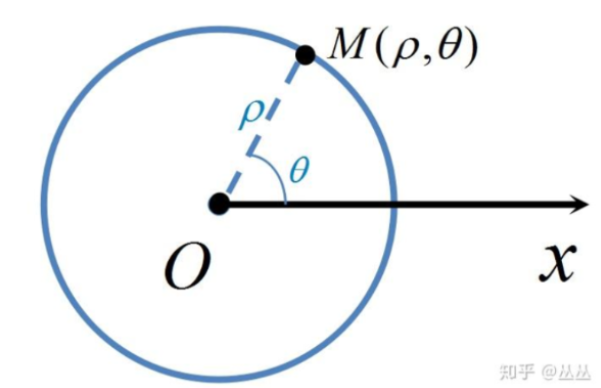
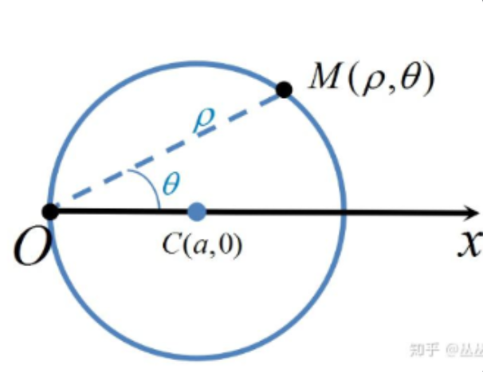
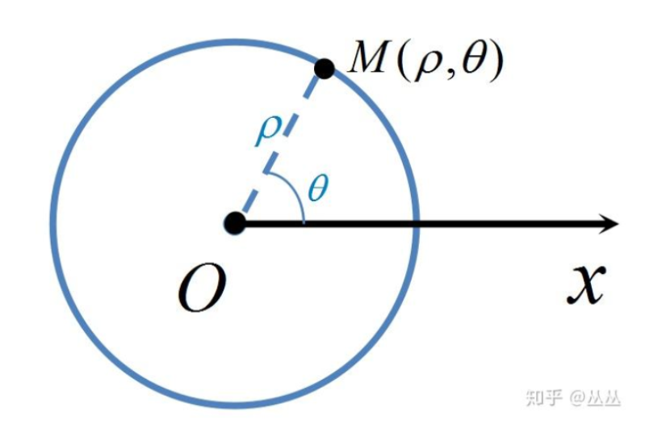

## 一些不知道放哪，但是需要注意的问题

### 极限存在的问题

直接上例题：

设 $f(x)$ 为连续函数，且 $\lim_{ x \to +\infty }e^{x}[1+x+f(x)]$ 存在，则曲线 $y = f(x)$ 有斜渐近线是：

 主要看，在上面的这个极限中，极限值是存在的，但是很明显，当 $x\to +\infty$ 的时候， $e^{x}$ 也是 $\to +\infty$ 的。然而这个极限依然存在，所以本质上后面的 $[1+x+f(x)]$ 在 $x\to +\infty$ 的时候是趋于 **0** 的。

那么变换一下就可以得到：

$$
\lim_{ x \to +\infty } 1 + x + f(x) \to 0
$$
$$
\lim_{ x \to \infty }f(x) \to -x - 1 
$$
所以 $f(x)$ 有斜渐近线为 $y = - x - 1$

> [!important]
> 注意，斜渐近线一定是斜着的

## 快速抓大头

抓大头直接得到结果：

$$
n^{n}>n!>a^{n}>n^{a}>n>\sqrt{n}>\ln n \quad(a>1,n>+\infty)
$$
## $n$ 次根号下累加的性质

$$
\lim_{n\to\infty}\sqrt[n]{a_{1}^{n}+a_{2}^{n}+\cdots+a_{n}^{n}}=max\{a_{i}\}\text{其中}a_{i}>0,i=1,2,\cdots, n
$$
例题：

$$
f(x) = \lim_{ n \to \infty }\sqrt[n]{ 1^{n} + {|x|}^{3n} } \quad \text{求}f(x)\text{在何处不可导}
$$
$$
\begin{aligned}
f(x)&=\lim_{n\to\infty}\sqrt[n]{1^{n}+|x|^{3n}} \\
&=\lim_{n\to\infty}\sqrt[n]{1^{n}+\left({|x|^{3}}\right)^{n}} \\
&=max\{1,|x|^{3}\}
\end{aligned}
$$

这个函数的图像如下：

可以很轻松的得到 $f(x)$ 在 $-1$ 和 $1$ 处不可导。

## 指数相乘三角函数的快速求积分

这个是对于指数相乘三角函数的快速求积分的方法

$$
\int e^{ax}\sin bxdx=\frac{1}{a^{2}+b^{2}}\left|\begin{array}{cc}(e^{ax})^{\prime}&(\sin bx)^{\prime}\\e^{ax}&\sin bx\end{array}\right|+c
$$
$$
\int e^{ax}\cos bxdx=\frac{1}{a^{2}+b^{2}}\left|\begin{matrix}(e^{ax})^{\prime}&(\cos bx)^{\prime}\\e^{ax}&\cos bx\end{matrix}\right|+c
$$
需要注意的是，核心是计算这个行列式。

## $f(x) = x\cdot \ln x$

$$
f(x) = x\cdot \ln x
$$

需要记忆这个函数的图像。

## $\ln(x+\sqrt{ 1+x^{2}})$

记忆

$$
g(x) = \ln (x + \sqrt{ 1+x^{2} })
$$

的有关性质。

1、 $g(x)$ 是一个奇函数

2、
 $$
g^{\prime}(x) = \frac{1}{\sqrt{ 1+x^{2} }}
$$
3、

$$
\int\frac{1}{\sqrt{1+x^{2}}}dx=\ln(x+\sqrt{1+x^{2}})+c
$$

这个公式的推导来自于基本积分公式：

$$
\int\frac{1}{\sqrt{x^{2}+a^{2}}}dx=\ln(x+\sqrt{x^{2}+a^{2}})+c
$$

4、

等价无穷小，这个有时候用的挺多的

$$
\ln(x+\sqrt{ x^{2} + 1 }) \sim x - \frac{x^{3}}{6} + o(x^{3})
$$
一般只用到前两项，如果还有必要，做题遇到再说，因为这个函数的导数不是很好求，不过依然可以用[泰勒展开](如何“发明”泰勒公式.md)求解。

## 关于 $\sqrt[n]{n}$ 的一些性质

1、$\sqrt[n]{ n }$ 的最大值是 $\sqrt[3]{ 3 }$

2、$\sqrt[x]{ x }$ 的最大值是 $\sqrt[e]{ e }$

3、

$$
\lim_{n\to\infty}\sqrt[n]{n}=\lim_{n\to\infty}\sqrt[n]{A}=1
$$
4、

$$
\lim_{n\to\infty}\sqrt[n]{a_{1}^{n}+a_{2}^{n}+\cdots+a_{n}^{n}}=\max \{a_{i}\} \quad (k_{i}\leq n)(a_{i}>0)
$$

## 导数与原式同时出现

如果 $f^{\prime}(x)$ 和 $f(x)$ 同时出现，那么需要考虑两种情况。

第一个，考虑拉格朗日中值定理

$$
f(x)-f(a)=f^{\prime}(\xi)\cdot(x-a) \quad \xi \in (a,x)
$$

第二个，考虑积分

$$
f(x) - f(a) = \int_{0}^{x} f^{\prime}(t)dt
$$
## 积分、连续、可导之间的关系

连续不一定可导，可导一定连续

不连续一定不可导 

设 $F(x) = \int_{a}^{x}f(x)dx$ ，若 $f(x)$ 可积，则 $F(x)$ 连续；若 $f(x)$ 连续， $F(x)$ 可导。

换句话说，如果能都能写出**积分公式**，则一定可积。而 $f(x)$ 连续则需要在**间断点处**进行判断是否**连续**

例如：

设 $f(x) = \begin{cases}\sin x \quad &0\leq x<\pi\\ 2 \quad &\pi\leq x\leq 2\pi& \end{cases}$ ， $F(x) = \int_{0}^{x}f(t)dt$ ，则：

因为已经写出了积分公式，所以其肯定是连续的，而在 $\pi$ 这个点上是 $f(x)$ 的第二类间断点。

直接就可以得到： $F(x)$ 在 $x = \pi$ 处是**连续且不可导**的

****

现在还有一种经常出现问题的结论：

但凡涉及到在**某个点处**（在**某个点的邻域**内）的导数大于 $0$ ，或者小于 $0$ ，都是**不能推断**出该函数在这个点的附近是单调增或者单调减的

> [!note]
> 只要是涉及到某个点处（或者某个点的邻域内）的问题，都要格外注意。

## 导数与极值的问题

>[!important]
>若 $f^{\prime\prime}(x_{0})=0$ ， $f^{\prime\prime\prime}(x_{0})\neq 0$ ，则 $(x_{0},f(x_{0}))$ 为拐点。
>
>若 $f^{\prime}(x_{0}) = 0$ ， $f^{\prime\prime}(x_{0})>0$ ，则 $(x_{0},f(x_{0}))$ 为极小值点
>
>若 $f^{\prime}(x_{0}) = 0$ ， $f^{\prime\prime}(x_{0})<0$ ，则 $(x_{0},f(x_{0}))$ 为极大值点

> [!important]
> 
> 反过来说，若 $(x_{0},f(x_{0}))$ 为拐点，且 $f^{\prime\prime}(x)$ 存在，则 $f^{\prime\prime}(x) = 0$ 。

其中，当二阶导数**小于 0**（ $y^{\prime\prime} < 0$ ）为**凸区间**

二阶导数**大于 0**（ $y^{\prime\prime} > 0$ ）为**凹区间**

> [!important]
> 若 $f^{(n)}(x) \neq 0$ ，则 $f(x) =0$ 至多有 $n$ 个不同**根**

## 参数方程求导

$$
\frac{dy}{dx} = \frac{{\frac{dy}{dt}}}{\frac{dx}{dt}}
$$
$$ 
\frac{d^{2}y}{dx^{2}} = \frac{d\left( \frac{dy}{dx} \right)}{dx} = \frac{\frac{d\left( \frac{dy}{dx} \right)}{dt}}{\frac{dx}{dt}}
$$

## 反函数求导问题

$y = f(x)$ ， $y^{\prime} = \frac{dy}{dx}$ ， $y^{\prime\prime} = \frac{d^{2}y}{dx^{2}} = \frac{d(y^{\prime})}{dx}$

然后是反函数：

然后是反函数：

**一阶导**：

$$
\frac{dx}{dy}  = \frac{1}{y^{\prime}} = \frac{dx}{dy}
$$

**二阶导**：

$$
\begin{aligned}
\frac{d^2{x}}{dy^{2}} & = \frac{d\left(  \frac{1}{y^{\prime}} \right)}{dy}\\
&  = - \frac{1}{(y^{\prime})^{2}} \frac{d(y^{\prime})}{dy}\\
& = - \frac{1}{(y^{\prime})^{2}}\cdot \frac{d(y^{\prime})}{dx}\cdot \frac{dx}{dy}\\
& = - \frac{1}{(y^{\prime})^{2}}\cdot y^{\prime\prime} \cdot \frac{1}{y^{\prime}}\\
& = - \frac{y^{\prime\prime}}{(y^{\prime})^{3}}
\end{aligned}
$$

## 常见导数中的构造问题

### 做差

无论是在高考还是考研中，都很难处理两个函数的问题，比如 $x^{2}  = e^{x}$ 。

一般都要转换成一个函数来处理。

**方法一般为做差**

### 导数与原函数之间的**构造**问题

一般来说，只要题目中提供了**导数与原函数**之间的**等数**关系

那么接下来就是要考虑使用构造函数的公式：

若欲证结论为" $\exists \delta \in (a,b)$ 使得， $f^{\prime}(\delta) + f(\delta)g(\delta) = 0$ "，这个时候，可以设置辅助函数为 $F(x) = f(x)\cdot e^{\int g(x) dx}$ ，然后对 $F(x)$ 使用罗尔定理，得到 $F^{\prime}(\delta) = 0$ ，化简既可以得到 $f^{\prime} + f(\delta)g(\delta) = 0$

### 其他常见的构造函数

比如遇到 $f(xy) = f(x) + f(y)$ ，则构造原函数为 $f(x) = \ln x$

比如遇到 $f(x+ y) = f(x)f(y)$ ，则构造原函数为 $f(x) = e^{x}$

## 常见函数的极限

$$
\lim_{x\to+\infty}e^{x}=+\infty
$$
$$
\lim_{x\to-\infty}e^{x}=0
$$

$$
\lim_{x\to0^{+}}e^{\frac{1}{x}}=+\infty 
$$
$$
\lim_{x\to0^{-}}e^{\frac{1}{x}}=0
$$

$$
\lim_{x\to+\infty}\frac{\sqrt{1+x^{2}}}{x}=1
$$
$$
\lim_{x\to-\infty}\frac{\sqrt{1+x^{2}}}{x}= -1
$$

$$
\lim_{x\to+\infty}\arctan x=\frac{\pi}{2}
$$
$$
\lim_{x\to-\infty}\arctan x=- \frac{\pi}{2}
$$

$$
\lim_{ x \to 0^{+} } \arctan \frac{1}{x} = \frac{\pi}{2} 
$$
$$
\lim_{ x \to 0^{-} } \arctan \frac{1}{x} = - \frac{\pi}{2}
$$

例题：

$$
\lim_{x\to\infty}\frac{1-e^{x}}{1+e^{x}}\arctan x
$$
这里需要分左右极限来处理。

$$
\begin{aligned}
&\lim_{x\to+\infty}\frac{1-e^{x}}{1+e^{x}}\arctan x\\
\Rightarrow&-1\cdot\frac{\pi}{2}=-\frac{\pi}{2}
\end{aligned}
$$

$$
\begin{aligned}&\lim_{x\to-\infty}\frac{1-e^{x}}{1+e^{x}}\arctan x\\
&\Rightarrow1\cdot-\frac{\pi}{2}=-\frac{\pi}{2}\end{aligned}
$$
## 全微分方程

$$
dz = \frac{{\partial z}}{\partial x}dx + \frac{{\partial z}}{\partial y}dy 
$$
其中 $z = f(x,y)$

### 反常积分的敛散性

1. 
$$
\int_{a}^{b}\frac{1}{\left(x-a\right)^{p}}dx\quad\quad\left\{
\begin{array}
{cc}p<1, & \text{收敛} \\
p\geq1, & \text{发散}
\end{array}\right.
$$
2. 

$$
\left.\int_{a}^{b}\frac{1}{\left(b-x\right)^{p}}dx\quad\quad\left\{
\begin{array}
{cc}p<1, & \text{收敛} \\
p\geqslant1, & \text{发散}
\end{array}\right.\right.
$$

3. 
   $$\int _{0}^{1} x^{p}|\ln x|^{q}dx\quad\left( \int_{0}^{1}(1-x)^{p}\Big|\ln(1-x)\Big|^{q}dx\right)$$
   
   当 $p>-1$ ， $q>-1$ 的时候**收敛**
   
4. 

$$
\sum_{n=2}^{+\infty} \frac{1}{n^{p}\ln^{q}n}
$$

   当 1. $p>1$ 或 2. $p=1$ ，且 $q>1$ 的时候**收敛**

5. 

$$
\int_{a}^{+\infty} \frac{1}{x^{p}\ln^{q}x}dx\quad(a>1)
$$
   当 $p>1$ 的时候**收敛**，当 $p=1$ ， $q>1$ 的时候**收敛**

6. 

$$
\int \frac{1}{x^{\alpha}\ln^{\alpha}x}dx
$$
   当 $x\to 0$ ， $\alpha<1$ 或者 $\alpha=1$ ， $\beta > 1$ 的时候**收敛**

   当 $x\to \infty$ ， $\alpha>1$ 或者 $\alpha=1$ ， $\beta>1$ 的时候**收敛**

## 变上限积分

### 变上限积分的无穷小问题

$$
\int_{0}^{x^{n}}t^{m}dt\text\quad{是}x\text{的}(m+1)\cdot n\text{阶无穷小}
$$

例题：

$$
x\rightarrow0\text{时，}\int_{0}^{x^{3}}(e^{t^{4}}-1)dt\quad\text{是}x\text{的几阶无穷小}
$$

$$
\int_{0}^{x^{3}}(e^{t^{4}}-1)dt = \int_{0}^{x^{3}} t^{4} dt
$$

根据上面的公式，得到原式是 $x$ 的 $(4+1)\times{3} = 15$ 阶无穷小。

### 变上限积分求导问题

$$
I(x) = \int_{u(x)}^{v(x)}f(t)dt
$$
$$
I^{\prime}(x) = f(v(x))\cdot v^{\prime}(x) - f(u(x))\cdot u^{\prime}u(x)
$$

此外，注意**换元问题**。如果是被积函数的主体是一个抽象函数，例如： $f(x-t)$ ，类似于这种的，都需要进行**换元处理**。

## 三步走和四步走

对于

$$
f(x)=\lim_{n\to\infty}\frac{x+e^{nx}}{1+e^{nx}}
$$

可以得到：

$$
\begin{cases}\frac{1+x}{2}&x=0\\1&x>0\\x+1&x<0\end{cases}
$$
核心在于将 $f(x)$ 中的 $n$ 去掉。

对于

$$
f(x)=\lim_{n\to\infty}\frac{1+x}{1+x^{2n}}
$$

可以得到：

$$
\begin{cases}1&x=1\\0&x=-1\\1+x&|x|<1\\0&|x|>1.\end{cases}
$$

关键是在于要学会对 $f(x)$ 进行分析。

## 三角函数与反三角函数以及导数

首先是三角函数：

三角函数求导不再赘述，至于后面复杂的三角函数，之间换回到简单三角函数即可。

然后是反三角函数：

反三角函数的求导在下面：

## 三角恒等变换相关公式

### 积化和差以及和差化积公式

$$
\begin{gathered}
\sin\alpha+\sin\beta=2\sin\frac{\alpha+\beta}{2}\mathrm{cos}\frac{\alpha-\beta}{2} \\
\sin\alpha-\sin\beta=2\cos\frac{\alpha+\beta}{2}\sin\frac{\alpha-\beta}{2} \\
\cos\alpha+\cos\beta=2\cos\frac{\alpha+\beta}{2}\cos\frac{\alpha-\beta}{2} \\
\cos\alpha-\cos\beta=-2\sin\frac{\alpha+\beta}{2}\sin\frac{\alpha-\beta}{2} 
\end{gathered}
$$
$$
\begin{gathered}
\tan\alpha+\tan\beta =\frac{\sin\left(\alpha+\beta\right)}{\cos\alpha\cos\beta} \\
\tan\alpha-\tan\beta =\frac{\sin\left(\alpha-\beta\right)}{\cos\alpha\cos\beta} \\
\cot\alpha+\cot\beta =\frac{\sin\left(\alpha+\beta\right)}{\sin\alpha\sin\beta} \\
\cot\alpha-\cot\beta =-\frac{\sin\left(\alpha-\beta\right)}{\sin\alpha\sin\beta}\\
\tan\alpha+\cot\beta =\frac{\cos\left(\alpha-\beta\right)}{\cos\alpha\sin\beta} \\
\tan\alpha-\cot\beta =-\frac{\cos\left(\alpha+\beta\right)}{\cos\alpha\sin\beta} \\
\end{gathered}
$$

记忆口诀：
正加正，正在前，
余加余，余并肩。
正减正，余在前，
余减余，负正弦。

积化和差公式：
$$
\begin{gathered}
\sin\alpha\cos\beta=\frac{1}{2}\Big[\sin\big(\alpha+\beta\big)+\sin\big(\alpha-\beta\big)\Big] \\
\cos\alpha\sin\beta=\frac{1}{2}\Big[\sin\bigl(\alpha+\beta\bigr)-\sin\bigl(\alpha-\beta\bigr)\Big] \\
\cos\alpha\cos\beta=\frac{1}{2}\Big[\cos\bigl(\alpha+\beta\bigr)+\cos\bigl(\alpha-\beta\bigr)\Big] \\
\sin\alpha\sin\beta=-\frac{1}{2}\Big[\cos\bigl(\alpha+\beta\bigr)-\cos\bigl(\alpha-\beta\bigr)\Big] 
\end{gathered}
$$

记忆口诀：
积化和差得和差，
余弦在后要相加；
异名函数取正弦，
正弦相乘取负号。

### 和差角公式

$$
\sin (\alpha\pm \beta) = \sin \alpha \cos \beta\pm \sin \beta \cos \alpha
$$
$$
\cos(\alpha\pm\beta)=\cos\alpha\cos\beta\mp\sin\alpha\sin\beta
$$
$$
\tan(\alpha\pm\beta)=\frac{\tan\alpha\pm\tan\beta}{1\mp\tan\alpha\tan\beta}
$$
### 六边形关系

其中有三组关系：

- 边上的三角函数两边相乘等于中间
- 染了色的三角形上面两个三角函数的平方和等于下面的
- 相对的三角函数是倒数关系

### 二倍角公式

$$
\sin 2\alpha = 2\sin \alpha \cos \alpha
$$
$$
\cos 2\alpha = \cos^{2}\alpha- \sin^{2}\alpha = 2\cos^{2}\alpha - 1 = 1 -2\sin^{2}\alpha
$$
$$
\tan 2 \alpha = \frac{2\tan \alpha}{1-\tan^{2}\alpha}
$$
### 三倍角公式

$$
\sin 3\alpha = 3 \sin\alpha \cos^{2}\alpha  -\sin^{3}\alpha
$$
$$
\cos 3\alpha = \cos^{3}\alpha - 3 \sin^{2}\alpha \cos \alpha
$$
### 半角公式

注意，具体需要**符号看象限**

$$
\sin\frac{\alpha}{2}=\pm\sqrt{\frac{1-\cos\alpha}{2}}
$$
$$
\cos\frac{\alpha}{2}=\pm\sqrt{\frac{1+\cos\alpha}{2}}
$$
$$
\tan\frac{\alpha}{2}=\pm\sqrt{\frac{1-\cos\alpha}{1+\cos\alpha}}
$$
$$
\tan\frac{\alpha}{2}=\frac{\sin\alpha}{1+\cos\alpha}=\frac{1-\cos\alpha}{\sin\alpha}
$$
### 降幂公式

$$
\sin \alpha \cos \alpha = \frac{\sin 2 \alpha}{2}
$$
$$
\sin^{2}\alpha = \frac{1-\cos 2\alpha}{2}
$$
$$
\cos^{2}\alpha = \frac{1+\cos 2 \alpha}{2}
$$
### 辅助角公式

$$
a\sin\theta+b\cos\theta=\sqrt{a^2+b^2}\sin(\theta+\varphi)
$$
其中， $\tan \varphi = \frac{b}{a}$

### 点鞭炮公式

$$
\cos\theta\cos2\theta\cos4\theta\cdots\cos2^n\theta=\prod_{i=0}^n\cos2^i\theta=\frac{\sin2^{n+1}\alpha}{2^{n+1}\sin\alpha}
$$
### 万能公式

辅助记忆图：

$$
\sin x=2\sin\frac{x}{2}\cos\frac{x}{2}=\frac{2\tan\frac{x}{2}}{\sec^{2}\frac{x}{2}}=\frac{2\tan\frac{x}{2}}{1+\tan^{2}\frac{x}{2}}
$$
$$
\cos x=\cos^{2}\frac{x}{2}-\sin^{2}\frac{x}{2}=\frac{1-\tan^{2}\frac{x}{2}}{\sec^{2}\frac{x}{2}}=\frac{1-\tan^{2}\frac{x}{2}}{1+\tan^{2}\frac{x}{2}}
$$
$$
\cot\alpha=\frac{1-\tan^2\frac{\alpha}{2}}{2\tan\frac{\alpha}{2}}
$$
$$
\sec\alpha=\frac{1+\tan^2\frac{\alpha}{2}}{1-\tan^2\frac{\alpha}{2}}
$$
$$
\csc\alpha=\frac{1+\tan^2\frac{\alpha}{2}}{2\tan\frac{\alpha}{2}}
$$
$$
\tan x=\frac{2\tan\frac{x}{2}}{1-\tan^2\frac{x}{2}}
$$
$$
\tan\frac{x}{2}=\frac{\sin x}{1+\cos x} = \frac{1- \cos \theta}{\sin \theta}
$$

## 切线方程

过 $P$ 点的切线方程为：

$$
y-f(a)= f^{\prime}(a)(x-a)
$$
若过P另有曲线C的切线，切点为 $Q(b,f(b))$，则切线为：

$$
y-f(a)=f^{\prime}(b)(x-a)
$$

## 曲率与曲率半径

曲率，主要是用到了与导数相关的知识。

曲率：

$$
K =\frac{|y^{\prime\prime}|}{\left[1+(y^{\prime})^{2}\right]^{\frac{3}{2}}}
$$
曲率半径：

$$
R = \frac{1}{K}
$$
## 曲线渐近线问题

### 曲线的斜渐近线

$$
\lim_{ x \to +\infty } \frac{y}{x} = k_{1}\text{且}\lim_{ x \to +\infty }(y-k_{1}x) = b_{1}  
$$
$$
\lim_{ x \to -\infty } \frac{y}{x} = k_{2} \text{且}\lim_{ x \to -\infty }(y-k_{2}x) = b_{2} 
$$
上面公式中的 $k_{1}$、$b_{1}$ 是斜率和截距

### 曲线的水平渐近线

$$
\lim_{ x \to +\infty }y = c_{1} 
$$
$$
\lim_{ x \to -\infty } y = c_{2}
$$
当 $c_{1} \neq c_{2}$ 的时候**有两条**水平渐近线。

### 曲线的垂直渐近线

$$
\lim_{ x \to x_{0}^{+} } f(x) = \infty \quad\text{或者} \quad\lim_{ x \to x_{0}^{-} }f(x) = \infty 
$$
$x = x_{0}$ 的时候，为垂直渐近线。

## 旋转曲面的侧面积问题

## 弧长问题

### 标准方程

对于 $L : y = f(x)$ ，其中 $(a\leq x\leq b)$

$$
s  = \int_{a}^{b}\sqrt{ 1 + f^{\prime 2}(x)}dx
$$
### 参数方程

对于 $L : \begin{cases}x =  x(t) \\y = y(t)& \end{cases}$ ， $(\alpha\leq t\leq \beta)$

$$
s = \int_{\alpha}^{\beta}\sqrt{ x^{\prime 2}(t) + y^{\prime 2}(t) }dt
$$
### 极坐标方程

对于 $L:\begin{cases}x = r(\theta)\cos(\theta)\\y = r(\theta)\sin(\theta)\end{cases}$ ，其中 $(\alpha \leq \theta\leq \beta)$

$$
s = \int_{\alpha}^{\beta}\sqrt{ r^{2}(\theta) + r^{\prime 2}(\theta) }d\theta
$$

## 中值定理

### 罗尔中值定理

若 $f(x)$ 在 $[a,b]$ 上连续，在 $(a,b)$ 上可导， $f(a) = f(b)$ ，则至少存在一点 $\xi\in(a,b)$ ，使 $f^{\prime}(\xi) = 0$

### 拉格朗日中值定理

若 $f(x)$ 在 $[a,b]$ 上连续，在 $(a,b)$ 上可导，则至少存在一点 $\xi \in (a,b)$ 使 $f^{\prime}(\xi) = \frac{f(b)-f(a)}{b-a}$

### 柯西中值定理

1. 若 $f(x)$  $g(x)$ 都在 $[a , b]$ 上连续，都在 $(a, b)$ 上可导，且 $g^{\prime}(x) \neq 0$ ，则至少存在一点 $\xi \in(a , b)$ . 使 $\frac{f(b)-f(a)}{g(b)-g(a)}=\frac{f^{\prime}(\xi)}{g^{\prime}(\xi)}$
2. 当 $g(x) = x$ 时 : 柯西 $\rightarrow$ 拉格朗日

### 泰勒中值定理

如果函数 $f(x)$ 在含有 $x_{0}$ 的开区间 $(a,b)$ 内有直到 $n+1$ 阶导数，则对任一点 $x_{0}\in (a,b)$ ，有：

$$
\begin{aligned}
f(x)=&f(x_{0})+f^{\prime}(x_{0})(x-x_{0})+\\
&\frac{f^{\prime\prime}(x_{0})}{2!}(x-x_{0})^{2}+\cdots+\frac{f^{(n)}(x_{0})}{n!}(x-x_{0})^{n}+
\\&\frac{f^{(n+1)}(\xi)}{(n+1)!}(x-x_{0})^{n+1}
\end{aligned}
$$

### 积分中值定理

设函数 $f(x)$ 是 $[a,b]$ 上的连续函数，则 $\exists \xi \in[a,b]$ ，使得 $\int_{a}^{b}f(x)dx = f(\xi)(b-a)$ 。

### 中值定理的构造问题

若欲证结论为" $\exists \delta \in (a,b)$ 使得， $f^{\prime}(\delta) + f(\delta)g(\delta) = 0$ "，这个时候，可以设置辅助函数为 $F(x) = f(x)\cdot e^{\int g(x) dx}$ ，然后对 $F(x)$ 使用罗尔定理，得到 $F^{\prime}(\delta) = 0$ ，化简既可以得到 $f^{\prime} + f(\delta)g(\delta) = 0$

设向量组 $\alpha_{1},\alpha_{2},\alpha_{3},\cdots ,\alpha_{s}$ 为齐次线性方程组 $AX = 0$ 的一个基础解系， $A\beta \neq 0$ ，此外， $B = (\beta,\beta+\alpha_{1},\beta+\alpha_{2},\cdots,\beta+\alpha_{s})$ ，为什么 $B$ 是线性无关的

### 二重积分中值定理

$$
\iint_{D}f\left(x,y\right)d\sigma=f\left(\xi,\eta\right)\iint_{D}d\sigma=f\left(\xi,\eta\right)\cdot\sigma = f\left(\xi,\eta\right) \cdot S_{D}
$$

## 欧拉公式

$$
sin\theta = \frac{e^{j\theta} - e ^{-j\theta}}{2j}
$$
$$
cos\theta = \frac{e^{j\theta} + e ^{-j\theta}}{2}
$$
$$
e^{j\theta} = cos{\theta} + j\times sin{\theta}
$$
## 泰勒公式的一些应用

首当其冲的就是求极限

这个就不多讲了，不过需要注意的是，一般上来讲，是 $x\to 0$ 的才行，还有就是可以多展开几项更加准确。

其次，就是[泰勒公式与高阶导数之间的关系](泰勒公式与高阶导数之间的关系.md)

这里不再赘述。

这里主要是说明泰勒公式在求和方面的应用。（或许未来会整理到一个单独的文件中。）

注意到常见的泰勒展开式前面是有系数的。

也就是说，当涉及到"系数"相加的情况，可以考虑泰勒公式。

例如下面这两个例子：

$$
1-\frac{1}{2}+\frac{1}{3}-\frac{1}{4}+\frac{1}{5}-\frac{1}{6}+\cdots = \ln 2
$$
这里主要用到了 $\ln(x+1)$ 的泰勒展开。

$$
\ln(x+1) = x-\frac{x^{2}}{2}+\frac{x^{3}}{3}+\cdots = \sum_{n=1}^{\infty}(-1)^{n-1}\frac{x^{n}}{n}\quad(-1<x\leq 1)
$$
令 $x=1$ 就可以得到上面的结果。

另外一个例子：

$$
\sum_{n=0}^{\infty}\frac{1}{n!} = e
$$
这个是用到了 $e^{x}$ 的泰勒展开式。

$$
e^{x} = \sum_{n=0}^{\infty}\frac{x^{n}}{n!}
$$
当 $x=1$ 的时候，与上式相等。

以此类推，可能会有 $\sin(1)$、$\cos(1)$ 之类的东西出现。

## 一些积分相关的东西

$$
(\sin^{2}x)^{\prime}  = 2 \sin x \cos x = \sin(2x)
$$
### 基本积分公式

$$
\int x^{\alpha}  dx= \frac{1}{\alpha + 1}x^{(\alpha + 1)}+ C\quad (\alpha \neq -1)
$$
$$
\int \frac{1}{x} dx = \ln|x| + C
$$
$$
\int a^{x} dx = \frac{a^{x}}{\ln a}+C\quad (a>0,a\neq 1)

$$
$$
\int e^{x} dx = e^{x} +C
$$
$$
\int \sin x dx = -\cos x + C
$$
$$
\int \cos x dx = \sin x +C
$$
$$
\int \tan x dx = - \ln |\cos x |  + C
$$
$$
\int \cot x dx = \ln|\sin x|+C
$$
$$
\int \sec^{2}xdx = \tan x+C
$$
$$
\int \csc^{2}xdx = -\cot x+C
$$
$$
\int \sec x\tan xdx = \sec x+C
$$
$$
\int \csc x\cot xdx = -\csc x+C
$$
$$
\int \sec xdx= \ln{|\sec x+\tan x|} + C
$$
$$
\int \csc xdx = -\ln{|\csc x + \cot x|}+C = \ln{|\csc x - \cot x|}+C
$$
$$
\int\frac{dx}{a^{2}+x^{2}} = \frac{1}{a}\arctan\frac{x}{a}+C
$$
$$
\int \frac{dx}{a^{2}-x^{2}} = \frac{1}{2a}\ln{\left|\frac{x+a}{x-a}\right|}+C
$$
$$
\int\frac1{x^2-a^2}\mathrm{d}x=\frac1{2a}\mathrm{ln}\Big|\frac{x-a}{x+a}\Big|+C 
$$
$$

\int \frac{dx}{\sqrt{ a^{2} - x^{2} } } = \arcsin\frac{x}{a} +C
$$
$$
\int \frac{dx}{\sqrt{ x^{2} + a^{2}}} = \ln{\left|x+\sqrt{ x^{2} + a^{2} }\right|}+C
$$
$$
\int\frac{dx}{\sqrt{ x^{2} - a^{2} }} = \ln{\left|x+\sqrt{ x^{2} - a^{2} }\right|} +C
$$
下面补充积分：

$$
\int \frac{1}{\sin x \cos x}  dx = \ln|\tan x|+C
$$

下面这俩个积分如果不背下来的话，也可以考虑**分部积分法**来构成**循环积分**来求解。

$$
\int \sqrt{ a^{2} - x^{2} }dx = \frac{a^{2}}{2}\arcsin\left( \frac{x}{a} \right) + \frac{x}{2} \sqrt{ a^{2} - x^{2} } +C
$$
$$
\int \sqrt{ x^{2} \pm a^{2} } dx = \pm \frac{a^{2}}{2}\ln(x+\sqrt{ x^{2} \pm a^{2} }) + \frac{x}{2}\sqrt{ x^{2} \pm a^{2} } + C
$$

### 形如 $\int\frac{a\sin x+b\cos x}{c\sin x+d\cos x}dx$

**核心要义就是令分子 = A 分母+B 分母的导数**

例如：

$$
\int \frac{3 \sin x - 7\cos x}{2\sin x+9\cos x}dx
$$
令 $3\sin x - 7\cos x = A(2\sin x+9\cos x) + B(2\cos x-9\sin x)$

可有得到：

$$
\begin{cases}
3=2A-9B \\
-7=9A+2B & 
\end{cases}
$$
> [!important]
> 
> 这里暂定，有些许问题，后续再处理。

### 贝塔函数和伽马函数

贝塔函数的定义是：

$$
B(p,q) = \int_{0}^{1}x^{p-1}(1-x)^{q-1}dx\quad\quad(p>0,q>0)
$$
#### 性质

对称性：

$$
B(p,q) = B({q,p})
$$
特殊值：

$$
B(1,1) = 1
$$
$$
B(\frac{1}{2},\frac{1}{2}) = \pi
$$
#### 与伽马函数之间的关系

$$
B(p,q) = \frac{\Gamma(p)\Gamma(q)}{\Gamma(p+q)}
$$
用这个可以快速求积分。

## 圆

圆的标准方程：

在平面直角坐标系内，以 $(a,b)$ 为圆心，以 $r$ 为半径，圆的标准方程是：

$$
(x - a )^{2} + (y - b)^{2} = r^{2}
$$
圆的一般方程，也是在平面直角坐标系内。

$$
x^2+y^2+Dx+Ey+F=0\quad(D^2+E^2-4F>0)
$$
其中，

圆心： 

$$
(x,y) = \left(-\frac{D}{2},-\frac{E}{2}\right)
$$

半径：

$$
r = \left( \frac{\sqrt{ D^{2} + E^{2} - 4F }}{2}\right)
$$
注意，若 $D^{2} + E^{2} -4F = 0$ ，则表示，此方程为一个**点**，如果小于 0，则表示为一个虚圆（在虚轴上）。

参数方程：

圆心为 $(a,b)$ ，半径为 $r$ ，参数为 $\theta$ 。

$$
\begin{aligned}
\begin{cases}
x=a+r\cos\theta \\
y=b+r\sin\theta & & 
\end{cases}(\theta\in[0,2\pi))
\end{aligned}
$$

极坐标方程：

圆的半径为 $R$

圆心在极点处时候：

极坐标方程为：

$$
\rho = r
$$
圆心在极轴上的圆，半径为 $r$ ，圆心为 $C(a,0)$

极坐标方程表示为：

$$
\begin{aligned}
&\cos\theta  =\frac{\rho}{2a} \\
\therefore \quad&\rho  =2a\cos\theta.
\end{aligned}
$$
过极点的圆：

圆心为 $C(a,\beta)$

极坐标方程为：

$$
\begin{aligned}
\cos(\theta-\beta)=\frac{\rho}{2a}\\
\therefore\rho=2a\cos(\theta-\beta)
\end{aligned}
$$

## 四种常用曲线

经常用于定积分求面积以及二重积分求体积。

### 星形线

基本方程：

$$
x^\frac{2}{3}+y^\frac{2}{3}=a^\frac{2}{3}
$$
参数方程：

$$
\begin{cases}
x=a\cos^3\theta \\
y=a\sin^3\theta & & 
\end{cases}
$$
图像：

### 摆线

参数方程：

$$
\begin{cases}
x=a(\theta-\sin\theta) \\
y=a(1-\cos\theta) & 
\end{cases}
$$
图像：

### 心形线

基本方程：

$$
x^2+y^2+ax=a\sqrt{x^2+y^2}
$$
极坐标方程：

$$
\rho=a(1-\cos\theta)
$$
图像：

### 伯努利双纽线

双纽线有两个，一个关于 **$Y$ 轴对称**，一个关于**原点对称**

#### $Y$ 轴对称双纽线

一般方程：

$$
\left(x^2+y^2\right)^2=a^2\left(x^2-y^2\right)
$$
极坐标方程：

$$
\rho^2=a^2\cos2\theta
$$
图像：

#### 原点对称双纽线

一般方程：

$$
\left(x^2+y^2\right)^2=2a^2xy
$$
极坐标方程：

$$
\rho^2=a^2\sin2\theta
$$
图像：

## 定积分求体积

些许题目的可以使用传统的求体积的方法：

### 贴近 x 轴 y 轴求体积

$y = g(x)$ 绕轴旋转一圈求体积

绕 x 轴旋转一周：

$$
V_{x}\Big|_{a}^{b} = \int_{a}^{b}\pi f^{2}(x)dx
$$
绕 y 轴旋转一周：

$$
V_{y}\Big|_{c}^{d} = \int_{c}^{d}\pi g^{2}(y)dy
$$

上面的公式适用于旋转体与 x 轴或 y 轴相近的情况，如果出现不相接触的情况用下面这个公式：

### 不贴近 x 轴 y 轴求体积

绕 y 轴：

$$
V_{y} = \int_{a}^{b}2\pi x(y_{1}-y_{2})dx
$$
绕 x 轴：

$$
V_{x} = \int_{a}^{b}2\pi y(x_{1}-x_{2})dy
$$
> [!Important]
> 注意，上面绕 x 轴公式中的 $x_{1}$ 和 $x_{2}$ 是关于 $y$ 的方程。

### 参数方程求体积

直接上方程

绕 x 轴：
$$
V = \pi \int_{\alpha}^{\beta}y^{2}(\theta)d(x(\theta))
$$
绕 y 轴：

$$
V = \pi \int_{\alpha}^{\beta}x^{2}(\theta)d(y(\theta))
$$
### 极坐标绕极轴的体积

$$
V = \frac{1}{2}\int_{\alpha}^{\beta}\rho^{2}(\theta)d\theta
$$
### 除极坐标的通用方法

利用二重积分求解定积分体积问题。

任意图形绕任意轴旋转一周的体积，有公式：

$$
V  = \iint_{D} 2\pi P(x,y)dxdy
$$
其中 $D$ 代表图形的限制范围

$P(x,y)$ 代表图形上任意一点 $(x,y)$ 到这条直线的距离，

直线距离公式：设直线方程为 $Ax+By+C = 0$ ，点 $P(x_{1},y_{1})$ ，

$$
D = \frac{Ax_{1}+By_{1}+C}{\sqrt{ A^{2}+B^{2} }}
$$
用语言描述就是，**将这个点代入到这个方程中，然后除以方程系数平方和的开根号。**

这么说不太好理解，来个例题：

求 $y=\cos x\left(-\frac{\pi}{2}\leq x \leq \frac{\pi}{2}\right)$ 与 $x$ 轴围成的区域绕 x 轴旋转一周的体积

根据上面的方法，可以直接列公式：

$$
\begin{aligned}
V &= \int_{-\frac{\pi}{2}}^{\frac{\pi}{2}}dx \int_{0}^{\cos x}2\pi(y)dy\\
&= \int_{-\frac{\pi}{2}}^{\frac{\pi}{2}}\left(\pi y^{2}\Big|^{\cos x}_{0}\right)dx\\
&= \int_{-\frac{\pi}{2}}^{\frac{\pi}{2}}\left(\pi \cos^{2}(x)\right)dx\\
&=2\pi \int_{0}^{\frac{\pi}{2}}(\cos^{2}(x))dx\\
&=2\pi \cdot\frac{1}{2}\cdot\frac{\pi}{2}\\
&=\frac{\pi^{2}}{2}
\end{aligned}
$$
上面就是利用二重积分求解体积。

不过需要注意的是，上面这个限制范围的 $x$ 是取值，而 $y$ 是函数的范围。

求 $y=\cos x\left(-\frac{\pi}{2}\leq x \leq \frac{\pi}{2}\right)$ 与 $x$ 轴围成的区域绕 y 轴旋转一周的体积

依然是直接列公式：

$$
\begin{aligned}
V &= \int_{0}^{\frac{\pi}{2}}dx \int_{0}^{\cos x}2\pi(x)dy\\
&=  \int_{0}^{\frac{\pi}{2}}\left( 2\pi x y\Big|_{0}^{\cos x}\right)dx\\
&=  \int_{0}^{\frac{\pi}{2}}(2\pi x\cos x)dx\\
&=2\pi \int_{0}^{\frac{\pi}{2}}xd(\sin x)\\
&= 2\pi\left(x\cdot \sin x\Big|_{0}^{\frac{\pi}{2}}- \int_{0}^{\frac{\pi}{2}}\sin xdx\right)\\
&=2\pi\left(\frac{\pi}{2}+\cos x\Big|_{0}^{\frac{\pi}{2}}\right)\\
&=2\pi\left(\frac{\pi}{2}-1\right)
\end{aligned}
$$

## 二重积分

除直接算之外，转换到极坐标系是一个很重要的方法。

$$
x = r \cos(\theta)
$$
$$
y = r \sin(\theta)
$$
$$
r = \sqrt{ x^{2} + y^{2} }
$$
注意，在变换的时候由于二重积分换元需要用**雅可比矩阵**进行验证

所以变换到极坐标系需要多乘一个 $r$

例如：

$$
\iint_D f(x, y) \, dx \, dy \quad \text{其中区域 } D: x^2 + y^2 \leq R^2
$$
变量替换： $x = r \cos \theta, \quad y = r \sin \theta$

利用雅可比矩阵换元： $dA = dx \, dy \rightarrow r \, dr \, d\theta$

积分区域： $0 \leq r \leq R, \quad 0 \leq \theta \leq 2\pi$

进而得到：
$$
\int_{0}^{2\pi} \int_{0}^{R} f(r \cos \theta, r \sin \theta) \cdot r \, dr \, d\theta
$$
特别注意：
$$
f(x, y) = x^2 + y^2 \quad \Rightarrow \quad r^2 \cdot r = r^3
$$

## 柯西积分不等式

若 $f(x)、$ $g(x)$ 在 $[a,b]$ 上连续，则有：

$$
\left(\int_{a}^{b}f(x)g(x)dx\right)^{2}\leq \int_{a}^{b}f^{2}(x)dx\cdot \int_{a}^{b}g^{2}(x)dx
$$
## 定积分与常数不等式

> [!note]
> 如果一个不等式的一端是定积分，一端是常数，则计算方法一定是先[积分中值定理](积分中值定理.md)，再[罗尔定理](中值定理.md#罗尔定理)

## 奇函数积分与偶函数积分

$$
\int_{0}^{x}奇dx = 偶
$$
$$
\int_{a}^{x}奇dx = 偶\quad\quad(a \neq 0)
$$
$$
\int_{0}^{x}偶dx = 奇
$$
$$
\int_{a}^{x}偶 dx =不一定为偶\quad\quad(a \neq 0)
$$
## 基本不等式

对于正实数 $a,b$ ，有：

$$
\frac{2}{\frac{1}{a}+\frac{1}{b}}\leq\sqrt{ab}\leq\frac{a+b}{2}\leq\sqrt{\frac{a^2+b^2}{2}}
$$
按照顺序得到的结果是：

调和 < 几何 < 算术 < 平方 

被称为**调几算方**

### N 元均值不等式

对于任意的正整数 $n$ ，以及任意 $a_{i} > 0\quad(i = 1,2,\cdots ,n)$ 有：

$$
\sqrt[n]{a_1a_2\cdots a_n}\leq\frac{a_1+a_2+\cdots+a_n}{n}
$$
写几个常用的：

$$
a+b \geq 2 \sqrt{ ab }
$$
$$
a+b+c \geq 3\sqrt[3]{ abc }
$$
$$
a+b+c+d \geq \sqrt[4]{ abcd }
$$
在往下延申不太常用

## 拉格朗日乘数法求解多元函数极值点

## 数列极限问题

在求数列极限的时候，如果是 $n\to +\infty$ ，且有 $X_{n+1} =f\left(X_{n}\right)$ ，直接令 $\lim_{ n \to \infty }X_{n+1} = \lim_{ n \to \infty }X_{n} = A$ ，代入到上述等式中，将 $A$ 求出。

不出意外的话，这个 $A$ 就是极限值（有可能有**多个**）。当然还需要证明其**单调**，以及验证**极限值唯一**

然后就是写过程，首先是用数学归纳法证明**有界性**。

1. 首项成立
2. 假设第 $n$ 项也成立
3. 代入到条件中，证明第 $n+1$ 项也成立。
4. 得到结论

然后是证明**单调性**

利用**后一项减前一项**：

$$
X_{n-1} - X_{n} = f(X_{n}) - X_{n}
$$
接下来就可以选择**构造函数进行求导**、使用**数学归纳法**，或者什么也不用，根据某些函数的性质、题目中的条件（大于 0 或者小于 0）即可得到证明。

> [!note]
> 此外，如果是数列极限与积分相结合，首先考虑观察此积分**是否能计算出来**。如果不能计算出来，需要考虑**积分中值定理**或者**放缩加夹逼**

> [!note]
> 
> 在证明数列 $\lim_{ n \to \infty }a_{n} = 0$ 的时候，可以使用对 $a_{n}$ 加上绝对值，使用夹逼定理的方法来解决。 $\lim_{ n \to \infty }|a_{n}| = 0$ ，因为绝对值大于 $0$ ，所以只需要证明一边即可。

## 常见泰勒公式

$$\begin{aligned} e^{x}&=\sum_{n=0}^{\infty} \frac{1}{n !} x^{n}=1+x+\frac{1}{2 !} x^{2}+\cdots ,x \in(-\infty,+\infty) \\ \sin x&=\sum_{n=0}^{\infty} \frac{(-1)^{n}}{(2 n+1) !} x^{2 n+1}=x-\frac{1}{3 !} x^{3}+\frac{1}{5 !} x^{5}+\cdots, x \in(-\infty,+\infty) \\ \cos x&=\sum_{n=0}^{\infty} \frac{(-1)^{n}}{(2 n) !} x^{2 n}=1-\frac{1}{2 !} x^{2}+\frac{1}{4 !} x^{4}+\cdots, x \in(-\infty,+\infty) \\ \tan x&=\sum_{n=1}^{\infty} \frac{B_{2 n}(-4)^{n}\left(1-4^{n}\right)}{(2 n) !} x^{2 n-1}=x+\frac{1}{3} x^{3}+\frac{2}{15} x^{5}+\frac{17}{315} x^{7}+\frac{62}{2835} x^{9}+\frac{1382}{155925} x^{11}+\frac{21844}{6081075} x^{13}+\frac{929569}{638512875} x^{15}+\cdots,x\in (-\frac{\pi}{2},\frac{\pi}{2}) \\\arctan x&=\sum_{n=0}^{\infty} \frac{(-1)^{n}}{2 n+1} x^{2 n+1}=x-\frac{1}{3} x^{3}+\frac{1}{5} x^{5}+\cdots+ x \in[-1,1] \\ \arcsin x&=\sum_{n=0}^{\infty} \frac{(2 n) !}{4^{n}(n !)^{2}(2 n+1)} x^{2n+1}=x+\frac{1}{6} x^{3}+\frac{3}{40} x^{5}+\frac{5}{112} x^{7}+\frac{35}{1152} x^{9}+\cdots+, x \in(-1,1)\\\ln (1+x)&=\sum_{n=0}^{\infty} \frac{(-1)^{n}}{n+1} x^{n+1}=x-\frac{1}{2} x^{2}+\frac{1}{3} x^{3}+\cdots, x \in(-1,1] \\ \frac{1}{1-x}&=\sum_{n=0}^{\infty} x^{n}=1+x+x^{2}+x^{3}+\cdots, x \in(-1,1) \\ \frac{1}{1+x}&=\sum_{n=0}^{\infty}(-1)^{n} x^{n}=1-x+x^{2}-x^{3}+\cdots, x \in(-1,1)\\ (1+x)^{\alpha}&=1+\sum_{n=1}^{\infty} \frac{\alpha(\alpha-1) \cdots(\alpha-n+1)}{n !} x^{n}=1+\alpha x+\frac{\alpha(\alpha-1)}{2 !} x^{2}+\cdots, x \in(-1,1) \\  \end{aligned}$$

下面进行补充一个不是很常用的等价无穷小：

$$
1 - \cos ^{a}x \sim \frac{a}{2}x^{2}
$$
这个地方还是比较好用的，如果 $a = \frac{1}{2}$ 还好说，直接有理化即可，如果是三次根号下，就不太好处理了，则用这个公式即可快速求出结果。

下面是推导过程：

$$
\begin{aligned}
1 - \cos ^{a}x &= 1- e^{a\ln \cos x}\\
& = 1 - [1 + a\ln \cos x]\\
& = 1- [1 + a(\cos x-1)]\\
& = 1- \left[1 +  a\left( 1-\frac{1}{2}x^{2} -1 \right) \right]\\
& = 1 -  \left( 1-\frac{a}{2}x^{2} \right)\\
& = \frac{a}{2}x^{2}
\end{aligned}
$$
关键点在于换成幂指函数的形式，然后利用泰勒展开即可。

来一道综合泰勒公式缝合极限题：

$$
\lim_{x\to0}\frac{e^x+\sin x+\cos x+\ln(1+x)+\sqrt{1+x}-\left(3+\frac{7}{2}x-\frac{5}{8}x^2+\frac{19}{48}x^3\right)}{x^4}
$$
