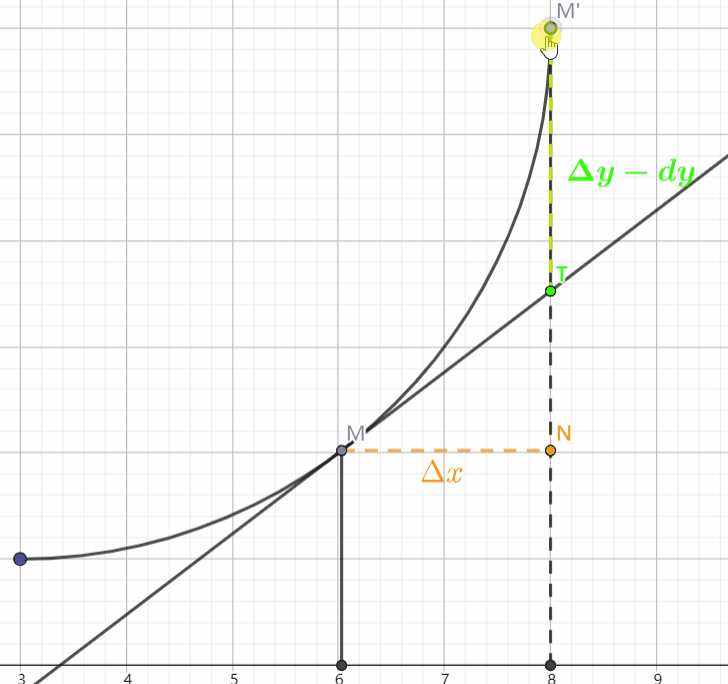
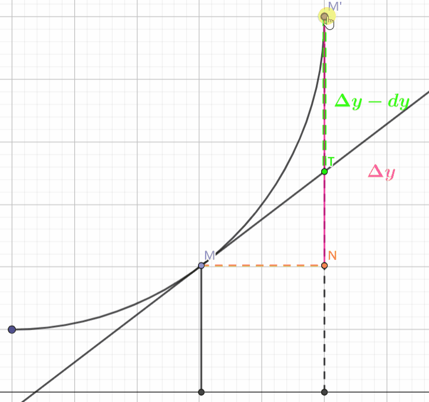
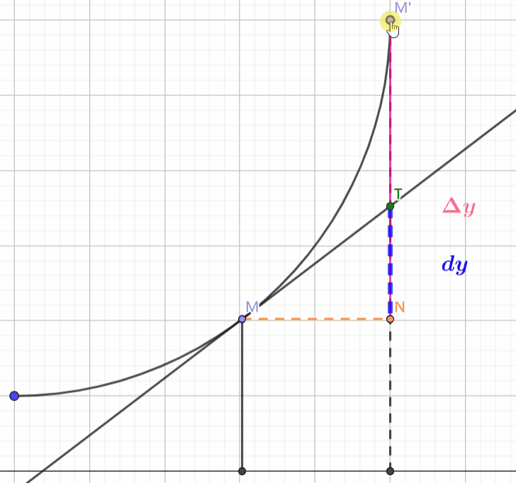
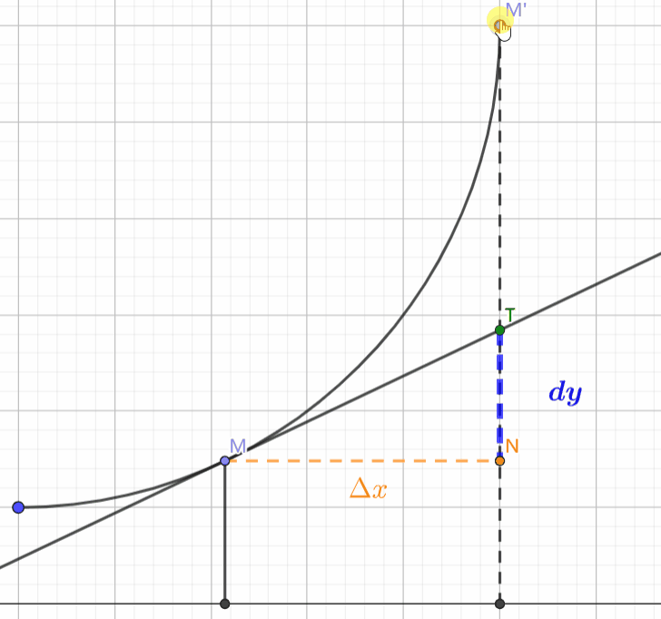

# 相关定义

核心就是上面图。

自变量在点 x 处的改变量 $\Delta x$ ，函数 $y = f(x)$ 的相应改变量 $\Delta y$ 可以表示为：

$$
\Delta y = A \Delta x + o(\Delta x)\quad(\Delta x \to 0)
$$
其中， $A \Delta x$ 作为 $\Delta y$ 的线性主部，即为函数 $y = f(x)$ 在 x 处的微分，记作：

$$
dy = A \Delta x = f^{\prime}(x)dx
$$
上面这个则是微分的定义，**非常重要**。

# 微分 dy 与改变量 $\Delta y$ 的关系

当 $\Delta x \to 0$ 时，自变量的改变量 $\Delta x$ 、微分 $\Delta y$ 、函数改变量 $dy$ 有下述关系。

## 第一个

当 $\Delta x \to 0$ 时， $\Delta y-dy$ 是一个比 $\Delta x$ 高阶的无穷小量

其含义是 $\Delta y - dy$ 【 $M^{\prime}T$ 】趋于 0 的速度大于 $\Delta x$ 【 $MN$ 】趋于 0 的速度。

$$
\lim_{ \Delta x \to 0 }\frac{\Delta y - dy}{\Delta x} = \lim_{ \Delta x \to 0 }\frac{\Delta y - A\Delta x}{\Delta x} = 0  
$$

## 第二个

当 $A = f^{\prime}(x) \neq 0$ 时，微分 $dy$ 与函数改变量 $\Delta y$ 的差是一个比 $\Delta y$ 高阶的无穷小量。

含义是： $\Delta y - dy$ 【 $M^{\prime}T$ 】趋于 0 的速度大于 $\Delta y$ 【 $M^{\prime}N$ 】趋于 0 的速度。

也就是分子趋于 0 的速度大于分母趋于 0 的速度。

$$
\lim_{\Delta\mathrm{x}\to0}\frac{\Delta\mathrm{y}-\mathrm{dy}}{\Delta\mathrm{y}}=\lim_{\Delta\mathrm{x}\to0}\frac{\mathrm{o}(\Delta\mathrm{x})}{\mathrm{A}\Delta\mathrm{x}+\mathrm{o}(\Delta\mathrm{x})}=\lim_{\Delta\mathrm{x}\to0}\frac{1}{\mathrm{A}[\Delta\mathrm{x}/\mathrm{o}(\Delta\mathrm{x})]+1}=0
$$

## 第三个

当 $A = f^{\prime}(x) \neq 0$ 时， $dy = A \Delta x$ 与 $\Delta y$ 是等价无穷小量

其含义是： $dy$ 【 $TN$ 】趋于 0 的速度等于 $\Delta y$ 【 $M^{\prime}N$ 】趋于 0 的速度。

也就是分子趋于 0 的速度等于分母趋于 0 的速度。

$$
\lim_{\Delta\mathrm{x}\to0}\frac{\Delta\mathrm{y}}{\mathrm{dy}}=\lim_{\Delta\mathrm{x}\to0}\frac{\mathrm{A}\Delta\mathrm{x}+\mathrm{o}(\Delta\mathrm{x})}{\mathrm{A}\Delta\mathrm{x}}=1+0=1
$$

## 第四个

当 $A = f^{\prime}(x)\neq 0$ 时， $dy = A \Delta x$ 与 $\Delta x$ 是同阶无穷小量。

其含义是： $dy$ 【 $TN$ 】趋于 0 的速度是 $\Delta x$ 【 $MN$ 】趋于 0 的速度的 $A$ 倍、

也就是分子趋于 0 的速度等于 $A \times$ 分母趋于 0 的速度。

$$
\lim_{\Delta\mathrm{x}\to0}\frac{\mathrm{dy}}{\Delta\mathrm{x}}=\lim_{\Delta\mathrm{x}\to0}\frac{\mathrm{A}\Delta\mathrm{x}}{\Delta\mathrm{x}}=\mathrm{A}\neq0
$$
