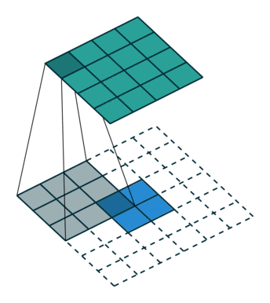

# 前言

- Python LLm(large language model)
- 处于当前最重要的是什么? ---> `Idea` 想法 主意 `(当下不缺牛人， 也不缺实现者)`
- 对于 正处于学习阶段的咱们来说 什么最重要? ---> `疑问` 在提问的过程中 也就有了思考 ---> 进而能加深印象 ---> `鼓励大家多去想 多问`
- 2023年度B站最佳弹幕? ---> `啊` 一方面表示惊讶 另一方面产生了疑问和兴趣

爱因斯坦: 发现问题比解决问题更重要

- 如何去学? 学习的方式?

1. 先确定自己想要什么, 想搞懂什么 ---> `目标`
2. 想要的都包含哪些部分 ---> `拆分目标`
3. 分阶段完成 ---> `建立节点，逐步完成`
4. 反思与回顾 ---> `总结经验与不足` ---> `多记笔记`

- 学习本身就是枯燥的过程, 只有对其感兴趣，才能学的深走的远~
- 讲课的过程: 是一个信息传递的过程, 是会存在**信息衰减,** 同时 趣味性 和 严谨性 通常是互斥的(即通俗易通, 和丰富的理论 是相违背的) ---> `仁者见仁, 智者见智` ---> 肯定得保证大家能听明白啊
- 最后 谁都可能会出错， **勇于质疑， 敢于提问**!

# 推荐

- 记笔记的方式: **markdown语法** `标记性语言` [语雀语法](https://www.yuque.com/yuque/gpvawt/lnobo9)
- 数学公式: LaTex 数学公式 [LaTex数学公式在线编辑](https://editor.codecogs.com/docs)
- 画思维导图: [在线思维导图](https://mm.edrawsoft.cn/app/create)
- 在线Visio替代: [Visio替代](https://app.diagrams.net/)
- 代码比对软件: **BeyondCompare4， notepad--， Pycharm也自带了**
- GPU机器: 百度的AI-studio(只能用Paddle框架) , AutoDL(需要了解Linux)

# 项目的背景和介绍

- 人工智能技术已深度渗透并广泛融入人类日常生活的各个领域。

就网上购物而言，用户角度的流程`下单-> 配送 -> 到货`。

**下单**: 最经典的就是大数据推荐，(可恨的)大数据杀熟

**配送**: 工厂接到订单,交由物流进行配送, 货物在一个中心进行统一的分拣和运输

**到货**：AI电话 可能就打过来了

- 本项目就是运用前沿的**人工智能技术(深度学习ResNet)**、**机器视觉技术(opencv)**, 构建一套高效能的物品分拣系统, 为现代的物流与制造提供了创新解决方案.

该系统能够通过集成摄像头等传感器设备，实时采集待分拣物品的信息，并利用计算机视觉算法对捕获的图像及视频数据进行深度处理与分析，精准识别物品种类，进而实现自动化分类作业


# 项目的结果展示


  
# 环境的安装

## 安装流程

1. 注册账户 [元宇宙实验中心](https://www.yyzlab.com.cn/)
2. 安装 `FS_AISIMS_V4_1_0_Setup.exe` [FS安装教程](https://hqyj.yuque.com/bi79a9/xxd4ky/zb1d77agn6f5r5yr?singleDoc#%20《虚拟仿真本地服务管理平台安装》)
3. 安装 `cuda_12.1.0_531.14_windows.exe` **(有显卡的才能安装)** [**CUDA安装教程**](https://hqyj.yuque.com/bi79a9/xxd4ky/bm1h0e3gtv35wrgk?singleDoc#%20《CUDA12.1%20安装教程》)
4. 安装 `证书`
5. 加载DLC `Pytorch(CUDA)版本` **(有显卡的才能安装)**
6. 安装 `Miniconda3-py38_23.11.0-1-Windows-x86_64.exe` [miniconda3教程](https://hqyj.yuque.com/bi79a9/xxd4ky/pvitx7gmiuofshzf?singleDoc#%20《Miniconda3安装》)
7. 安装 `pycharm-community-2022.3.3.exe` [Pycharm安装教程](https://hqyj.yuque.com/bi79a9/xxd4ky/vfdaib8q3zrcs3bp?singleDoc#%20《Pycharm社区版%202022.3.3安装》)
8. 安装 `MQTTX-Setup-1.11.0-x64.exe`

## 环境测试

1. 检测 `Pytorch CUDA`是否正常
2. 登录 `3D分拣场景` 测试MQTT通信
3. 创建 `Pycharm 项目` 并配置解释器

# 数据通信MQTT

- MQTT（Message Queuing Telemetry Transport）工作在 TCP/IP协议族上，是一种轻量级的、基于发布/订阅模式的消息传输协议，专为低带宽、不可靠网络环境下的设备通信而设计，尤其适用于**物联网**（IoT）设备之间的通信。

## IP和Port概念

- IP地址是Internet中主机的标识
- Internet中的主机要与别的机器通信必须具有一个IP地址
- IP地址为32位（IPv4）或者128位（IPv6）
- 表示形式：常用点分形式，如202.38.64.10，最后都会转换为一个32位的无符号整数。

分类及取值范围:

A类：1.0.0.1~126.255.255.254

B类：128.0.0.1~~191.255.255.254

C类：192.0.0.1~~223.255.255.254

D类（组播地址）：224.0.0.1~~239.255.255.254

E类：保留待用 11110

- **特殊地址**: `127.0.0.1` 回环地址/环路地址 (代表自己)

**感兴趣**:

可以查看`C:\Windows\System32\drivers\etc\hosts`文件 **不要乱改!!!**

`hosts`: 主要作用定义IP地址和主机名的映射关系.

当用户在浏览器中输入一个需要登录的网址时，系统会首先自动从Hosts文件中寻找对应的IP地址，一旦找到，浏览器会立即打开对应网页，如果没有找到，则浏览器会将网址提交DNS服务器进行IP地址解析

## MQTT通信原理

- 直接使用`IP地址和端口号`进行TCP/IP通信在企业中不用,在高校教学中使用
- 在企业中都是使用封装好的深度定制的协议

### MQTT架构

- 主要包括三个部分: `客户端(Client)`、`代理(Broker)`和`主题(Topic)`
- **客户端(Client)**：任何连接到MQTT代理的设备都被称为客户端，客户端可以是**发布者**(Publisher)或**订阅者**(Subscriber)。
- **代理(Broker)**：代理是MQTT协议的核心，它负责接收、过滤和分发消息给订阅者。代理确保消息从发布者传递到一个或多个订阅者。
- **主题(Topic)**：主题是消息的类别或地址。发布者将消息发布到特定的主题，而订阅者订阅他们感兴趣的主题以接收相关消息


### 发布/订阅模式

- **发布者(Publisher)**：发布者向代理发布消息，并指定消息的主题。
- **订阅者(Subscriber)**：订阅者向代理订阅一个或多个主题，以接收相应的消息。
- **代理(Broker)**：代理接收发布者的消息，并将其分发给订阅了相应主题的订阅者

### MQTT消息格式

- **固定头部(Fixed Header)**：包括消息类型、标志和剩余长度。
- **可变头部(Variable Header)**：根据不同类型的消息包含不同的信息，例如主题名、消息标识符等。
- **有效载荷(Payload)**：实际传递的数据内容。

### QOS(服务质量）

- **QoS 0**：最多一次（At most once）。消息不进行确认，**可能会丢失**。
- **QoS 1**：至少一次（At least once）。消息至少传递一次，但可能**会重复**。
- **QoS 2**：只有一次（Exactly once）。**消息保证只传递一次，确保不重复**。

本次项目中QoS级别默认使用**QoS为0**

### **保持连接(Keep Alive)**

- MQTT客户端和代理之间通过**心跳包来保持连接**，确保双方的连接状态。如果在设定的时间内**没有心跳包传递**，连接将**被认为是断开**。

## 本项目中用到的MQTT协议

**Json** (JavaScript Object Notation), 是一种轻量级数据交换格式

- 由一个大括号表示, 由通过键值对来描述对象的属性
- `键值之间使用冒号连接, 多个键值对之间使用逗号分隔`
- 和Python中 `dict`数据格式很**像** **但两者需要转换!!!**

```
{ 
  "name": "小陈", 
  "age": 20, 
  
  "pengyou":["张三","李四","王二","麻子",
    { 
    "name":"小明", 
    "info":"像彭于晏一样帅气的男人" 
    }
  ], 
  
  "wuqi":{ 
    "name":"大长刀", 
    "length":"40m" 
  } 
}
```

  

### 控制类协议

- 用户通过程序给**分拣模式**, **控制推杆**或**传送带**等控制类协议
- 发布的Topic为: `aa`


| 功能     | JSON                          |
| ------ | ----------------------------- |
| 推出一号推杆 | {"rod_control":"first_push"}  |
| 拉回一号推杆 | {"rod_control":"first_pull"}  |
| 推出二号推杆 | {"rod_control":"second_push"} |
| 拉回二号推杆 | {"rod_control":"second_pull"} |
| 推出三号推杆 | {"rod_control":"third_push"}  |
| 拉回三号推杆 | {"rod_control":"third_pull"}  |
| 推出四号推杆 | {"rod_control":"fourth_push"} |
| 拉回四号推杆 | {"rod_control":"fourth_pull"} |
| 推出所有推杆 | {"rod_control":"all_push"}    |
| 拉回所有推杆 | {"rod_control":"all_pull"}    |
| 传送带运行  | {"conveyor":"run"}            |
| 传送带停止  | {"conveyor":"stop"}           |

### 反馈类协议

- 指**采集模式**或**分拣模式**下的光电门信息的上传协议
- Topic为: `bb`


| 功能        | JSON                    |
| --------- | ----------------------- |
| 一号光电开关有遮挡 | {”first_switch”:True}   |
| 一号光电开关无遮挡 | {”first_switch”:False}  |
| 二号光电开关有遮挡 | {”second_switch”:True}  |
| 二号光电开关无遮挡 | {”second_switch”:False} |
| 三号光电开关有遮挡 | {”third_switch”:True}   |
| 三号光电开关无遮挡 | {”third_switch”:False}  |

  

## 分析整体的流程

1. 连接MQTT进行通信
2. 订阅对应主题
3. 控制传送带启动
4. 一号推杆 推出(push) ---> 然后拉回(pull)
5. 分析图像, 获得分类
6. 在获得对应光电门消息后,控制推杆推出 ---> 拉回
7. 一号杠重新推出 然后 循环

## 对应的MQTT代码

- 蓝色软件对应的 `CMD`终输入

```
python -m pip install --upgrade pip --user -i https://mirrors.aliyun.com/pypi/simple/
```

```
python -m pip install --upgrade paho-mqtt --user -i https://mirrors.aliyun.com/pypi/simple/
```

**详细代码**

```python
import json
import uuid
import time
import base64
import requests     # 灰色 表示导入但是 没有用到
import threading
from enum import Enum
import paho.mqtt.client as mqtt
from paho.mqtt.enums import CallbackAPIVersion        # 导入包


class StateRod(Enum):       # 枚举类 ->杆的状态
    stop = 0            # 停止
    push = 1            # 推
    pull = 2            # 拉


class PosObj(Enum): # 枚举类
    before_1st = 0          # 在 1号光电门之前
    at_1st = 1              # 在 1号光电门
    between_1st_and_2nd = 2     # 在 1到2号  光电门之间
    at_2nd = 3                  # 在 2号    光电门
    between_2nd_and_3rd = 4     # 在 2到3号  光电门之间
    at_3rd = 5                  # 在 3号    光电门
    beyond_3rd = 6              # 在 3号    光电门后


class Mqtt_Clt(object):
    def __init__(self, ip_broker, port_broker, topic_sub, topic_pub, time_out_secs, client_id=None):
        """
        表示  需要你介绍一下 这个类或函数的作用  连接MQTT
        :param ip_broker: MQTT的IP
        :param port_broker: MQTT的端口
        :param topic_sub:   订阅的主题
        :param topic_pub:   发布的主题
        :param time_out_secs:   超时时间
        :param client_id:   连接的ID
        """
        # client_id = None
        if client_id is not None:
            self.client_id = client_id
        else:
            # uuid.uuid4函数 会生出全球同一时刻唯一的ID
            self.client_id = "Mqtt_Clt_" + str(uuid.uuid4())

        self.mqtt_ip = ip_broker
        self.mqtt_port = port_broker
        self.topic_sub = topic_sub
        self.topic_pub = topic_pub
        self.time_out_secs = time_out_secs
        self.msg = {}       # 接受的消息 他是一个dict

        # 实例化
        self.mqttc = mqtt.Client(# callback_api_version=CallbackAPIVersion.VERSION2,
            client_id=self.client_id,
            clean_session=False)

        # 其他回调函数 查看 Client 源码 728 line
        self.mqttc.on_message = self.on_message

        # 连接MQTT
        self.mqttc.connect(self.mqtt_ip, self.mqtt_port, self.time_out_secs)
        # 订阅主题
        self.mqttc.subscribe(self.topic_sub, qos=0)
        # 持续连接
        self.mqttc.loop_start()

    def __del__(self):
        self.mqttc.loop_forever()
        self.mqttc.disconnect()

    def on_message(self, client, userdata, message):
        self.msg = json.loads(message.payload.decode())

    def send_json_msg(self, msg):
        self.mqttc.publish(self.topic_pub, payload="{}".format(msg))

    def control_device(self, str_key, str_value):
        self.send_json_msg(json.dumps({str_key: str_value}))


class FS_IIOTA(object):
    def __init__(self, ip_mqtt_broker, website_back_end):
        self.mqtt_clt = Mqtt_Clt(ip_mqtt_broker, 21883, "bb", "aa", 50, "FS_Ctl")

        self.website_back_end = website_back_end

        # 目标位置
        self.obj_pos = PosObj.before_1st  # 起始位置
        # 上货推杆的状态
        self.stat_stack_rod = StateRod.stop     # 起始状态  停止
        # 分类杆的状态
        self.stat_classify_rod = StateRod.stop  # 起始状态  停止

        # 哪个分类要动作
        self.classify_rod_act_num = 1       # 默认只 设为1
        # 备份一次这个变量
        self.classify_rod_act_num_temp = self.classify_rod_act_num

        # 传送带启动
        self.mqtt_clt.control_device("conveyor", "run")
        
        time.sleep(2)

        # 定义两个定时器  定时器的作用就是 定期的执行某个函数
        self.timer_stack_rod = None
        self.timer_classify_rod = None

        # rod_control 杆  第一个杆推出
        self.mqtt_clt.control_device("rod_control", "first_push")
        self._convert_rod_status("stack", StateRod.push, 1.5)

    def __del__(self):
        self.mqtt_clt.control_device("rod_control", "all_pull")
        time.sleep(1)
        self.mqtt_clt.control_device("conveyor", "stop")
        time.sleep(1)
    
    def _convert_rod_status(self, rod_name, rod_status, wait_time=1):
        if rod_name == "stack":
            self.stat_stack_rod = rod_status
            self.timer_stack_rod = threading.Timer(wait_time, self.handle_timer_stack_rod)
            self.timer_stack_rod.start()
        
        elif rod_name == "classify":
            self.stat_classify_rod = rod_status
            self.timer_classify_rod = threading.Timer(wait_time, self.handle_timer_classify_rod)
            self.timer_classify_rod.start()
        
        else:
            print("rod_name参数错误! 参数: ", rod_name)

    def handle_timer_stack_rod(self):
        if self.stat_stack_rod == StateRod.push:
            
            self.mqtt_clt.control_device("rod_control", "first_pull")
            print("上货杆已推出")
            self._convert_rod_status("stack", StateRod.pull, 1)
 
        elif self.stat_stack_rod == StateRod.pull:
            print("上货杆已拉回")
            self.stat_stack_rod = StateRod.stop

    def handle_timer_classify_rod(self):
        if self.stat_classify_rod == StateRod.push:
            str_classify_rod_cmd = ""
            if self.classify_rod_act_num_temp == 2:
                str_classify_rod_cmd = "second"
            elif self.classify_rod_act_num_temp == 3:
                str_classify_rod_cmd = "third"
            elif self.classify_rod_act_num_temp == 4:
                str_classify_rod_cmd = "fourth"
            
            str_classify_rod_cmd += "_pull"
            print("str_classify_rod_cmd:", str_classify_rod_cmd)
            self.mqtt_clt.control_device("rod_control", str_classify_rod_cmd)

            self._convert_rod_status("classify", StateRod.pull, 1)

        elif self.stat_classify_rod == StateRod.pull:
            print("分类杆已拉回")
            
            self.classify_rod_act_num = 1
            self.stat_classify_rod = StateRod.stop

            self.mqtt_clt.control_device("rod_control", "first_push")
            self._convert_rod_status("stack", StateRod.push, 1)

    def handle_mqtt_json_msg(self, total_tolerance):
        cnt_except = 0
        label_dict = {
            "ripe": 2,
            "half_ripe": 3,
            "raw": 4
        }

        while cnt_except < total_tolerance:
            if self.mqtt_clt.msg != {}:
                if "image" in self.mqtt_clt.msg:
                    
                    # print(self.mqtt_clt.msg)
                    img_data = base64.b64decode(self.mqtt_clt.msg["image"])  # 解码获得图像数据
                    
                    try:
                        # 调用识别服务
                        # result = json.loads(requests.post(self.website_back_end,
                        #                                   data=img_data).text)  # 将图像数据img_data给POST出去并获得相应的结果result
                        # print("识别结果:", result)

                        result = {"code": 0,
                                  "results": [{"label": "ripe"}]}

                        if result["code"] == 0:
                            
                            label = result["results"][0]["label"]
                            if label in label_dict.keys():
                                self.classify_rod_act_num = label_dict[label]
                                print(f"{label}: {self.classify_rod_act_num}号推杆将动作")
                            else:
                                self.classify_rod_act_num = 1
                                print("哪个分类杆都不动作")
                        
                        else:
                            print("识别错误! 报错信息: ", result["error"])
                            cnt_except += 1
                    
                    except:
                        print("Post无法请求!")
                        cnt_except += 1
                
                elif "first_switch" in self.mqtt_clt.msg:

                    if self.obj_pos == PosObj.before_1st and self.mqtt_clt.msg["first_switch"]:
                        self.obj_pos = PosObj.at_1st
                    
                    elif self.obj_pos == PosObj.at_1st and not self.mqtt_clt.msg["first_switch"]:
                        self.obj_pos = PosObj.between_1st_and_2nd
                    
                    else:
                        print("1号对管处位置有误!")
                        cnt_except += 1
                
                elif "second_switch" in self.mqtt_clt.msg:
                    # self.obj_pos = PosObj.at_2nd if self.mqtt_clt.msg["second_switch"] else PosObj.between_2nd_and_3rd
                    if self.obj_pos == PosObj.between_1st_and_2nd and self.mqtt_clt.msg["second_switch"]:
                        self.obj_pos = PosObj.at_2nd
                    
                    elif self.obj_pos == PosObj.at_2nd and not self.mqtt_clt.msg["second_switch"]:
                        self.obj_pos = PosObj.between_2nd_and_3rd
                    
                    else:
                        print("2号对管处位置有误!")
                        cnt_except += 1

                elif "third_switch" in self.mqtt_clt.msg:
                    # self.obj_pos = PosObj.at_3rd if self.mqtt_clt.msg["third_switch"] else PosObj.beyond_3rd
                    if self.obj_pos == PosObj.between_2nd_and_3rd and self.mqtt_clt.msg["third_switch"]:
                        self.obj_pos = PosObj.at_3rd
                    
                    elif self.obj_pos == PosObj.at_3rd and not self.mqtt_clt.msg["third_switch"]:
                        self.obj_pos = PosObj.beyond_3rd
                    
                    else:
                        print("3号对管处位置有误!")
                        cnt_except += 1

                self.mqtt_clt.msg = {}
            
            self.state_machine()

        if cnt_except >= total_tolerance:
            print("已经达到系统容忍错误上线, 需重启mqtt_sthsz.py")
            cnt_except = 0

    def state_machine(self):
        if self.obj_pos != PosObj.before_1st and self.obj_pos != PosObj.at_1st:
            if self.classify_rod_act_num == 2:
                if self.obj_pos == PosObj.between_1st_and_2nd:
                    self.mqtt_clt.control_device("rod_control", "second_push")
                    print("2号推杆推出")
                    self._convert_rod_status("classify", StateRod.push, 1)

                    self.classify_rod_act_num_temp = self.classify_rod_act_num
                    self.classify_rod_act_num = 1
                    self.obj_pos = PosObj.before_1st

            elif self.classify_rod_act_num == 3:
                if self.obj_pos == PosObj.between_2nd_and_3rd:
                    self.mqtt_clt.control_device("rod_control", "third_push")
                    print("3号推杆推出")
                    self._convert_rod_status("classify", StateRod.push, 1)

                    self.classify_rod_act_num_temp = self.classify_rod_act_num
                    self.classify_rod_act_num = 1
                    self.obj_pos = PosObj.before_1st
            
            elif self.classify_rod_act_num == 4:
                if self.obj_pos == PosObj.beyond_3rd:
                    self.mqtt_clt.control_device("rod_control", "fourth_push")
                    print("4号推杆推出")
                    self._convert_rod_status("classify", StateRod.push, 1)

                    self.classify_rod_act_num_temp = self.classify_rod_act_num
                    self.classify_rod_act_num = 1
                    self.obj_pos = PosObj.before_1st
           
            else:
                if self.obj_pos == PosObj.beyond_3rd:
                    self.obj_pos = PosObj.before_1st

                    self.mqtt_clt.control_device("rod_control", "first_push")
                    self._convert_rod_status("stack", StateRod.push, 1)


if __name__ == "__main__":
    # 实例化一个类   127.0.0.1 表示本机
    fs_iiota = FS_IIOTA("127.0.0.1", "http://127.0.0.1:8088/aisim_tf_pre")
    fs_iiota.handle_mqtt_json_msg(total_tolerance=5)
```


# ResNet对应服务的后端代码

```python
import os
import cv2
import json
import torch
import threading
import numpy as np
import torch.nn as nn
from queue import Queue
from flask_cors import CORS
from flask import Flask, request

from ResNet import resnet18
from utils.tools import device, dataset_transform

# 定义消息队列
picture_recognized = Queue(5)
recognized_result = Queue(5)

# 实例化一个Flask类
app = Flask(__name__)
"""
    跨域的作用:
        前端能够直接访问它的后端,但其他后端不能直接访问某一特定后端,这个时候就需要跨域技术来使其他后端能够直接访问这个特定的后端
        (BS架构(B浏览器S服务器)需要后端访问后端)
"""
CORS(app, supports_credentials=True)  # 支持跨域


@app.route("/aisim_tf_pre", methods=["POST"])  # 指定路由(POST:访问方式)
def get_picture_post_result():
    global picture_recognized
    global recognized_result
    tmp_res = {"results": [], "code": 1, "error": ""}
    upload = request.get_data()
    if upload:
        try:
            image_array = np.frombuffer(upload, np.uint8)
            img = cv2.imdecode(image_array, cv2.IMREAD_COLOR)
            picture_recognized.put(img)

            tmp_res["results"] = recognized_result.get()
            tmp_res["code"] = 0
        except Exception as e:
            tmp_res["error"] = str(e)
        return json.dumps(tmp_res)


def object_classify():
    json_path = 'utils/class_indices.json'
    assert os.path.exists(json_path), "file: '{}' dose not exist.".format(json_path)

    global picture_recognized
    global recognized_result

    with open(json_path, "r") as fd_js:
        class_indict = json.load(fd_js)

    model = resnet18().to(device)
    num_features = model.fc.in_features
    model.fc = nn.Linear(num_features, 3).to(device)

    model.load_state_dict(torch.load('./model/best.pth', weights_only=True))
    # model.load_state_dict(torch.load('./model/best.pth', weights_only=True,
    #                                   map_location=torch.device('cpu')))  # CPU加载
    model.eval()

    while True:
        input_img = picture_recognized.get()
        input_img = cv2.cvtColor(input_img, cv2.COLOR_BGR2RGB)

        input_tensor = dataset_transform(input_img)
        input_tensor = input_tensor.unsqueeze(0).to(device)

        with torch.no_grad():
            output = model(input_tensor)
            probabilities = torch.nn.functional.softmax(output[0], dim=0)

        predicted_confidence, predicted_class = torch.max(probabilities, dim=0)
        predict_class = class_indict[str(predicted_class.item())]

        recognized_result.put([{"label": predict_class,
                                "confidence": predicted_confidence.item()}])


if __name__ == "__main__":
    t_object_classify = threading.Thread(target=object_classify)
    t_object_classify.start()

    app.run(host="0.0.0.0", port=8088, debug=False)
```

```python
import torch
import torch.nn as nn


# 定义 BasicBlock
class BasicBlock(nn.Module):
    expansion = 1

    def __init__(self, inplanes, planes, stride=1, downsample=None):
        super(BasicBlock, self).__init__()
        self.conv1 = nn.Conv2d(in_channels=inplanes, out_channels=planes, kernel_size=3, stride=stride, padding=1,
                               bias=False)
        self.bn1 = nn.BatchNorm2d(planes)
        self.relu = nn.ReLU(inplace=True)
        self.conv2 = nn.Conv2d(in_channels=planes, out_channels=planes, kernel_size=3, stride=1, padding=1, bias=False)
        self.bn2 = nn.BatchNorm2d(planes)
        self.downsample = downsample

    def forward(self, x):
        identiy = x
        out = self.conv1(x)
        out = self.bn1(out)
        out = self.relu(out)

        out = self.conv2(out)
        out = self.bn2(out)
        if self.downsample is not None:
            identiy = self.downsample(x)
        out += identiy
        out = self.relu(out)
        return out


# 定义bottleneck
class Bottleneck(nn.Module):
    expansion = 4

    def __init__(self, inplanes, outplanes, stride=1, downsampe=None):
        super(Bottleneck, self).__init__()
        self.conv1 = nn.Conv2d(in_channels=inplanes, out_channels=outplanes, kernel_size=1, stride=1, bias=False)
        self.bn1 = nn.BatchNorm2d(outplanes)

        self.conv2 = nn.Conv2d(in_channels=outplanes, out_channels=outplanes, kernel_size=3, stride=stride, padding=1,
                               bias=False)
        self.bn2 = nn.BatchNorm2d(outplanes)

        self.conv3 = nn.Conv2d(in_channels=outplanes, out_channels=outplanes * self.expansion, kernel_size=1, stride=1,
                               bias=False)
        self.bn3 = nn.BatchNorm2d(outplanes * self.expansion)

        self.relu = nn.ReLU(inplace=True)
        self.downsampe = downsampe

    def forward(self, x):
        identity = x
        out = self.conv1(x)
        out = self.bn1(out)
        out = self.relu(out)

        out = self.conv2(out)
        out = self.bn2(out)
        out = self.relu(out)

        out = self.conv3(out)
        out = self.bn3(out)

        # 捷径分支有两种
        if self.downsampe is not None:
            identity = self.downsampe(x)

        out += identity
        # 激活
        out = self.relu(out)
        return out


# 定义类
class ResNet(nn.Module):
    def __init__(self, block, layers, num_classes=1000):
        super(ResNet, self).__init__()
        # 定义一个变量表示输出通道数
        self.inplanes = 64
        # 手动算出来padding是多少，加快网络运行速度
        # bias偏置不用偏置，因为有了bn层后，bias是无效的，此外运算速度会变快
        self.conv1 = nn.Conv2d(in_channels=3, out_channels=self.inplanes, kernel_size=7, stride=2, padding=3,
                               bias=False)
        # 使用BN层
        self.bn1 = nn.BatchNorm2d(self.inplanes)
        # 使用激活函数
        self.relu = nn.ReLU(inplace=True)
        # 最大池化
        self.maxpool = nn.MaxPool2d(kernel_size=3, stride=2, padding=1)
        self.layer1 = self._make_layer(block, outplanes=64, blocks=layers[0], stride=1)
        self.layer2 = self._make_layer(block, outplanes=128, blocks=layers[1], stride=2)
        self.layer3 = self._make_layer(block, outplanes=256, blocks=layers[2], stride=2)
        self.layer4 = self._make_layer(block, outplanes=512, blocks=layers[3], stride=2)
        # 自适应池化
        self.avgpool = nn.AdaptiveAvgPool2d((1, 1))
        self.fc = nn.Linear(512 * block.expansion, num_classes)

    # 给这些模块单独做一个函数
    def _make_layer(self, block, outplanes, blocks, stride=1):
        # 考虑捷径分支 有两种，一个是普通的捷径分支一个是特殊的捷径分支
        downsample = None
        if stride != 1 or self.inplanes != outplanes * block.expansion:
            downsample = nn.Sequential(
                nn.Conv2d(in_channels=self.inplanes, out_channels=outplanes * block.expansion, kernel_size=1,
                          stride=stride, bias=False),
                nn.BatchNorm2d(outplanes * block.expansion), )
        layers = []
        layers.append(block(self.inplanes, outplanes, stride, downsample))
        self.inplanes = outplanes * block.expansion
        for i in range(1, blocks):
            layers.append(block(self.inplanes, outplanes))
        return nn.Sequential(*layers)

    def forward(self, x):
        x = self.conv1(x)
        x = self.bn1(x)
        x = self.relu(x)
        x = self.maxpool(x)

        x = self.layer1(x)
        x = self.layer2(x)
        x = self.layer3(x)
        x = self.layer4(x)
        x = self.avgpool(x)
        # 展平
        x = torch.flatten(x, 1)
        x = self.fc(x)
        return x


def resnet18(num_class=1000):
    return ResNet(BasicBlock, layers=[2, 2, 2, 2], num_classes=1000)


def resnet34(num_class=1000):
    return ResNet(BasicBlock, layers=[3, 4, 6, 3], num_classes=1000)


def resnet50(num_class=1000):
    return ResNet(Bottleneck, layers=[3, 4, 6, 3], num_classes=1000)


if __name__ == '__main__':
    device = torch.device("cuda" if torch.cuda.is_available() else "cpu")
    model = resnet34(1000).to(device)
    # from torchsummary import summary

    # print(summary(model, input_size=(3, 224, 224)))
```

# 全连接神经网络

- 英文全称 **(Fully Connected Neural Network, FcNN)**
- 一个神经元的数学公式 $Y= \sigma (W^{T} * X + b)$

> [!note] 
> Sigmoid 激活函数： $sigmoid = \frac{1}{1+e^{-x}}$ ，Relu 激活函数： $Relu = max\{x,0\}$
> 
> 
> 
> 

## 特点与参数


- **特点:** 它的每个节点都与下一层的所有节点有连接
- 参数量是多少? 参数量怎么计算? ----> ${Input}_{shape} \times {Output}_{shape} + {Output}_{shape}$ 

1. 由`Input Layer ---> Hidden Layer`: 输入`1*3` 输出`1*5` 参数量为: `1*3 x 1*5 + 1*5`
2. 由 `Hidden Layer ---> Output Layer`: 输入`1*5` 输出 `1*2` 参数量为: `1*5 x 1*2 + 1*2`

## 实操环节 --- 全连接与链式求导

- 神经网络的目标? 可以理解`找到一条近似的函数(曲线)` [1-D 在线演示](https://cs.stanford.edu/people/karpathy/convnetjs/demo/regression.html)
- 如何找出拟合的函数?

举例 $y = kx + b$ 决定因素 **k和b**

举例 $Y = k_{i}^{2} *X+K_{j}^{3}*X + b$ 决定因素 $k$ 和 $b$ 。

- 找出 $k$ 和 $b$ 即找出拟合的函数
- BP算法(Error Back Propagation)是一种按照误差逆向传播算法, 包含了 前向传播, 反向传播 主要是: 反向传播(链式求导)
- 前向传播: **由输入得到输出的过程 (推理 预测)**
- 如何衡量这个得到的输出是否准确? ---> `损失函数`
- 损失函数： 用来度量模型的预测值与真实值的差异程度的运算函数; 损失函数的值越小, 说明函数(网络)拟合的越好.
- 反向传播: **最小化损失函数** 求损失函数对权重的偏导，然后更新权重 更新的过程 ---> **优化器(optimizer)**
- 优化器: 按照梯度的反方向调整权重 w，通过适当的学习率(决定了每次更新的步长)，我们可以逐步调整权重，使损失函数逐渐减小。

**对于函数的某个特定点，它的梯度就表示从该点出发，函数值增长最为迅猛的方向**

**打开元宇宙实验平台，进行实验**

`w11_1 = 0.1` `b1_1 = 0.6`

`w12_1 = 0.9` `b2_1 = 0`

`w11_2 = -1.5` `w21_2 = 0.1` `b1_2 = 0.9`


## 源码分析

[torch源码官网2.4版本](https://pytorch.org/docs/2.4/)

[nn.Linear文档](https://pytorch.org/docs/2.4/generated/torch.nn.Linear.html#torch.nn.Linear)

```python
import torch
import torch.nn as nn

m = nn.Linear(in_features=20, out_features=30)
input_data = torch.randn(128, 20)       # 128组 每一组 20各个点
output = m(input_data)
print(output.size())        # 128, 30
```

## 利用框架后的代码

```python
import torch
import numpy as np
import torch.nn as nn
import matplotlib.pyplot as plt

# 固定随机种子
torch.manual_seed(0)

# 数据输入
points = np.array([[0.8, 0], [1.1, 0],
                   [1.7, 0], [1.9, 0],
                   [2.7, 1], [3.2, 1],
                   [3.7, 1], [4.0, 1],
                   [5.0, 0], [5.5, 0],
                   [6.0, 0], [6.3, 0]])

# 对数据进行处理  (X是输入， y是输出)
X = torch.tensor(points[:, 0].reshape(-1, 1), dtype=torch.float32)
y = torch.tensor(points[:, 1].reshape(-1, 1), dtype=torch.float32)

# 模拟输入
x_values = torch.tensor(np.linspace(0, 7, 100), dtype=torch.float32).unsqueeze(1)
print(x_values.shape)   # (100, 1)


# 定义模型
class Model(nn.Module):
    def __init__(self, input_size, hidden_size, output_size=1):
        super(Model, self).__init__()
        self.fc1 = nn.Linear(in_features=input_size, out_features=hidden_size)
        self.fc2 = nn.Linear(in_features=hidden_size, out_features=output_size)

    def forward(self, x):   # 前向传播
        out = torch.sigmoid(self.fc1(x))
        out = torch.sigmoid(self.fc2(out))
        return out


# 实例化模型
model = Model(input_size=1, hidden_size=2, output_size=1)
# 实例化 损失函数
loss_func = nn.MSELoss()
# 实例化 优化器 SGD: w -= lr*dw
optimizer = torch.optim.SGD(model.parameters(), lr=0.5)

# 开始训练
epoch_num = 5000
loss_values = []
for epoch in range(1, epoch_num + 1):
    # 设置模型为训练模式
    model.train()

    # 前向传播
    y_pred = model(X)
    loss = loss_func(y_pred, y)     # 计算损失
    loss_values.append(loss.item())     # item转换为python数据类型

    # 反向传播
    optimizer.zero_grad()  # 优化器 梯度清零
    loss.backward()         # 反向传播
    optimizer.step()        # 更新参数 完成一次迭代

    frequency_display = 100
    if epoch % frequency_display == 0 or epoch == 1:
        # 绘制拟合曲线
        y_values = model(x_values).detach().numpy()

        plt.clf()  # 清空当前子图内容
        # 绘制第一个子图，内容为散点拟合曲线图
        plt.subplot(2, 1, 1)
        # 定义标题为当前步数值
        plt.title(f'Step: {epoch}')
        # 绘制散点
        plt.scatter(X[:, 0], y, color='red', label='Original points')
        # 绘制曲线
        plt.plot(x_values, y_values, color='blue', label='Fitted curve')
        # 显示图像中散点和曲线对应的标签
        plt.legend()

        # 绘制第二个子图，内容为损失函数曲线图
        plt.subplot(2, 1, 2)
        # 绘制曲线
        plt.plot(range(len(loss_values)), loss_values, color='green')
        # 定义横坐标的标签
        plt.xlabel('Iteration')
        # 定义纵坐标的标签
        plt.ylabel('Loss')
        # 定义标题为损失值
        plt.title('Loss Curve')
        # 定义两个子图之间的垂直距离
        plt.subplots_adjust(hspace=0.5)
        plt.pause(0.5)
plt.show()

```

# 分类和交叉熵

- 因为最后的任务是一个**分类任务**，损失函数就要为交叉熵损失

## SoftMax函数

- 公式： $Softmax(Z_{i}) = \frac{e^{Z_{i}}}{\sum_{i}e^{Z_{i}}}$
- 通常要减去最值, 防止数值溢出： $Softmax(Z_{i}) = \frac{e^{Z_{i} - max()}}{\sum_{i}e^{Z_{i}-max()}}$

输入范围： `[-10, 10] 取10个点` 绘制的图像。


### 特点

- 对于任意输入向量，Softmax函数的输出都是非负的
- Softmax函数的输出总和为1，因此可用于表示概率分布
- 当输入向量的元素全部为正时，Softmax函数会放大差异，使得输出更加“尖锐”

## 交叉熵(CrossEntropy)

- 表达式为： $H(p,q) = -\sum_{i=1}^{N}p(x_{i})\log q(x_{i})$
- 交叉熵是信息熵论中的概念，它原本是用来估算平均编码长度的。在深度学习中，可以看作**通过概率分布q(x)表示概率分布p(x)的困难程度**

**交叉熵刻画的是两个概率分布的距离，也就是说交叉熵值越小（相对熵的值越小），两个概率分布越接近**。

### 源码分析

[**CrossEntropy源码**](https://pytorch.org/docs/stable/generated/torch.nn.CrossEntropyLoss.html#torch.nn.CrossEntropyLoss) **比较硬核，建议不看**

[**交叉熵讲解**](https://zhuanlan.zhihu.com/p/638725320)

```python
import torch
import torch.nn as nn

torch.manual_seed(0)


data1 = torch.randn((2, 3))
print(data1)

data2 = torch.tensor([[9, 7, 2],
                      [9, 5, 3]], dtype=torch.float32)
print(data2)

loss_func = nn.CrossEntropyLoss()
target = torch.tensor([[1, 0, 0], [1, 0, 0]], dtype=torch.float32)

softmax_data1 = torch.softmax(data1, dim=1)
print(softmax_data1)

loss1 = loss_func(data1, target)
print(loss1)

# loss2 = loss_func(softmax_data1, target)
# print(loss2)

loss3 = loss_func(data2, target)
print(loss3)
```

# 卷积

- 英文名称 `convolution` ---> 记作`Conv`
- 计算机眼中的图像

需要熟悉 **像素** **BGR** 这两个概念

[2分钟小视频](https://www.bilibili.com/video/BV1Q94y1B7Ze)

## 数学上的定义

f(t) 和 g(t) 是两个函数 h(t) 是二者卷积，其中t为时刻

- **f(t) 和 g(t) 连续** $h(t) = \int_{-\infty}^{+\infty}f(\tau)*g(t-\tau)d\tau$ **思想: 平移、相乘、求积分**
- **f{t) 和 g(t) 离散** $h(t) = \sum_{-\infty}^{+\infty}f(\tau)*g(t-\tau)$ 
- **思想: 步长滑动、相乘、相加 ---> 卷积的思想**

## 图像中的卷积

- 指用一个小的**卷积核**与目标图像进行**相乘相加**计算，从而**提取目标图像中的某些特征**，比如边缘、角点等
- **一张图解释如下 (左侧原图, 中间为卷积核, 右侧为卷积后的结果)**
- **从左到右， 从上到下**


## 特点

1. 有种正则化的感觉 （参数少, 相对于全连接）
2. 对输入的权重共享 (提取的共性特征）
3. 相对位置敏感

## Padding方式（Pytorch中的方式）

- `same`： stride=1的条件下 才可以 表示卷积后的结果和输入相同
- `vaild`: 相等于没有填充
- 默认`补0` **pytorch中 先补右下**

## Stride步长

- **表示每次滑动的距离 不能超过卷积核的大小, 否则会丢特征!!!**

## 卷积图像大小计算公式

$$
Size = \left[\frac{{N-k+2p}}{S} + 1\right]
$$
- 其中`N表示图像的宽或高`， `k表示卷积核大小`， `p表示填充的个数`, `S表示步长`
- 简单理解： $Size = \left[\frac{{(\text{宽} - \text{核}) + 2 *\text{补}}}{\text{步长}} + 1\right]$

## 卷积核为什么都是奇数?

- 当卷积核的大小是奇数时，它具有唯一的一个中心像素，这个中心像素点可以作为滑动的默认参考点，即锚点。
- 在进行空间卷积时，可以确保卷积核有一个明确的中心像素，这有助于处理图像的边缘和边界像素，避免模糊和信息损失。

## 源码分析

[Conv2d-2.4版本源码](https://pytorch.org/docs/2.4/generated/torch.nn.Conv2d.html#torch.nn.Conv2d)

`conv1d`: 针对序列数据， 数据维度 `(bs, channels, width)`

`conv2d`: 针对对于图像数据, 数据维度`(bs, channels, height, width)`

`conv3d`: 针对3d物体，数据维度`(bs, channels, Depth, height, width)`

```python
import torch
import torch.nn as nn

torch.manual_seed(0)

data1 = torch.tensor([[1, 0, 0, 0, 1],
                      [0, 1, 0, 1, 0],
                      [0, 0, 1, 0, 0],
                      [0, 1, 0, 1, 0],
                      [1, 0, 0, 0, 1]], dtype=torch.float32)
data1 = data1.unsqueeze(0)

kernel = torch.tensor([[0, 0, 1],
                       [0, 1, 0],
                       [1, 0, 0]], dtype=torch.float32)
kernel = kernel.unsqueeze(0).unsqueeze(0)

conv1 = nn.Conv2d(in_channels=1, out_channels=1, kernel_size=3, stride=1, padding=0)
weight1 = nn.Parameter(kernel)
conv1.weight.data = weight1

output1 = conv1(data1)
print(output1)
print(conv1.weight.data.shape)
```

## 其他的卷积类型

### 多通道卷积(重要)

**核心**

1. 卷积核的通道数 = **输入特征**的通道数
2. 卷积核的个数 = **输出特征**的个数


**参数量计算**

1. 大小为$5*5$像素, 3通道彩色图片 ---> 经过一层卷积(1个$3*3$卷积核) `结果的特征图是几个? 参数量是多少?`

- 结果特征图数量 等于 卷积核的个数 参数量: $1*3*3*3$（$个数*通道数*卷积核宽*卷积核高$）

2. 大小为$5*5$像素, 3通道彩色图片 ---> 经过一层卷积(2个$3*3$卷积核) `结果的特征图是几个? 参数量是多少?`

- 数量: 2 参数量: $2*3*3*3=54$（$个数*通道数*卷积核宽*卷积核高$）

3. 大小为$5*5$像素, 3通道彩色图片 ---> 得到特征图还是2个 `在输出特征图大小不变的前提下如何缩小参数 (提示可以有两层)`

- 结果先不说 ---> 后面深度可分离再讲

### 三维卷积

- 二维卷积是在单通道的一帧图像上进行滑窗操作，输入是高度H宽度W的二维矩阵
- 如果涉及到**视频上的连续帧**或者**立体图像中的不同切片**，就需要引入深度通道，此时输入就变为高度H*宽度W*深度D的三维矩阵


### 反卷积

- 卷积是对输入图像及进行特征提取，这样会导致尺寸会越变越小，而`反卷积`是进行相反操作。
- 只是并不会完全还原到跟输入图一样，只是保证了与输入图像尺寸一致，主要用于向**上采样 (UpSample)**



### 空洞卷积

- 为扩大`感受野`, 在卷积核的元素之间插入空格“膨胀”内核，形成“空洞卷积”（或称膨胀卷积）

感受野（Receptive Field），指的是神经网络中神经元“看到的”输入区域，在卷积神经网络中，feature map上某个元素的计算受输入图像上某个区域的影响，这个区域即该元素的感受野

- 用膨胀率参数`L`表示要扩大内核的范围，即在内核元素之间插入`L-1`个空格。当`L=1`时，则内核元素之间没有插入空格，变为标准卷积.

**图为**`L=2`**的空洞卷积**


### 深度可分离卷积

- 由逐深度卷积和逐点卷积组成
- 深度卷积用于提取**空间特征**， 逐点卷积用于提取**通道特征**


回看刚才的问题

大小为$5*5$像素, 3通道彩色图片 ---> 得到特征图还是$2$个 `在输出特征图大小不变的前提下如何缩小参数`

- 正常情况下用 $2$个$3*3$的卷积就可以 ---> 参数量: $2*3*3*3$ ($个数*通道数*卷积核宽*卷积核高$)
- 但是利用深度可分离, 先用$1$个$3*3$，再用$2$个$1*1$ ---> 参数量: $1*3*3*3 + 2*1*1*1$

### 分组卷积

- 2012年，AlexNet论文中最先提出来的概念，当时主要为了解决GPU显存不足问题，将卷积分组放到两个GPU中并行执行。
- 在分组卷积中，卷积核被分成不同的组，每组负责对相应的输入层进行卷积计算，最后再进行合并


### 具体代码

```python
import torch
import torch.nn as nn


# kernel_size=3 stride=1 padding=0 
conv1 = nn.Conv2d(in_channels=3, out_channels=8, kernel_size=3, stride=1)

# kernel_size=5 stride=1 padding=1 
conv2 = nn.Conv2d(in_channels=3, out_channels=10, kernel_size=5, stride=1, padding=1)

# kernel_size=3 stride=2 pading=0
conv3 = nn.Conv2d(in_channels=3, out_channels=12, kernel_size=3, stride=2)

data1 = torch.randn(5, 3, 50, 50) # 5组/个batch, 3个通道, 50*50个像素点
data2 = torch.randn(5, 3, 50, 100)  # 5组/个batch, 3个通道, 50*100个像素点
data3 = torch.randn(3, 100, 100)    # 3个通道, 100*100个像素点
output1_1 = conv1(data1)
print(output1_1.shape)

# output1_2 = conv1(data2)
# print(output1_2.shape)

# output1_3 = conv1(data3)
# print(output1_3.shape)

# output2_1 = conv2(data1)
# print(output2_1.shape)

# output3_1 = conv3(data1)
# print(output3_1.shape)
```

# 池化

- 英文`pooling` 也被称作 `downsample 降采样`
- 是一种用于**减少**卷积神经网络(CNN)中**特征图大小**的操作。它通过将特征图上的局部区域进行聚合，得到一个更小的特征图。
- **不改变通道数**

## 常见的形式

1. **最大池化(Max Pooling)** **以2*2池化核为例**

- 可以保留局部区域中最显著的特征。最大池化在提取图像中的纹理、形状等方面具有很好的效果


1. **平均池化(Avg Pooling)** **以2*2池化核为例**

- 在提取图像中的整体特征、减少噪声等方面具有较好的效果


## 池化图像大小计算公式

$$
Size = \left[\frac{{N-k+2p}}{S}+1\right]
$$
- 其中 `N表示图像的宽或高`， `k表示池化核大小`, `S表示步长`， `p表示填充(可以忽略)`
- 简单理解： $Size = \left[\frac{(宽-核)}{步长}+1\right]$

## 源码分析

[pool2d-2.4版本网址](https://pytorch.org/docs/2.4/generated/torch.nn.MaxPool2d.html#torch.nn.MaxPool2d)

```python
import torch
import torch.nn as nn


# kernel_size=3 stride=1
maxpool1 = nn.MaxPool2d(kernel_size=3, stride=2)

# kernel_size=5 stride=1
maxpool2 = nn.MaxPool2d(kernel_size=(3, 2), stride=(2, 1))


data1 = torch.randn(5, 3, 50, 50) # 5组/个batch, 3个通道, 50*50个像素点
data2 = torch.randn(5, 3, 50, 100)  # 5组/个batch, 3个通道, 50*100个像素点
output1_1 = maxpool1(data1)
print(output1_1.shape)

# output1_2 = maxpool1(data2)
# print(output1_2.shape)

# output2_1 = maxpool2(data1)
# print(output2_1.shape)

# output2_2 = maxpool2(data2)
# print(output2_2.shape)
```

# ResNet网络

- **ResNet**("残差网络")简称由Microsoft研究团队于2015年提出。它在当时的ImageNet比赛获得了图像分类第一名，目标检测第一名，在COCO数据集目标检测第一名，图像分割第一名。
- 主要特点是采用了**残差学习**机制。在传统的神经网络中，每一层的输出都是直接通过一个非线性激活函数得到的。但在ResNet中，每一层的输出是通过一个“残差块”得到的，该残差块包含了一个快捷连接（shortcut）和几个卷积层。这样，在训练过程中，每一层只需要学习残差（即输入与输出之间的差异），而不是所有的信息。这有助于**防止梯度消失和梯度爆炸**的问题，从而使得网络能够训练得更深。
- esNet论文中共提出了五种结构，分别是`ResNet-18`, `ResNet-34`, `ResNet-50`, `ResNet-101`, `ResNet-152`


- 论文地址: [ResNet论文](https://arxiv.org/abs/1512.03385)

## Residual结构(残差结构)

- 文章中提供了两种不同的残差结构。

`ResNet-18和ResNet-34左侧图` `ResNet-50 ResNet-101和ResNet-152右侧图`


- **左侧图**: 输入一个channels为64的特征矩阵, 主分支先是经过一个3x3卷积然后Relu激活, 再经过一个3x3的卷积，与圆弧分支`shortcut(捷径分支)`,一起**相加**运算，再经过Relu激活。主分支的输出矩阵与shortcut的输出矩阵的shape(宽、高、channels)必须相同。
- **右侧图**: 输入一个channels为256的特征矩阵, 主分支先经过1x1卷积降维然后Relu,再经过3x3卷积特征提取，然后Relu激活,最后经1x1卷积升维256，与shortcut进行**相加**运算,Relu后输出.
- shortcut不仅有输出等于输入, 还有输入特征矩阵的宽高变化


- `实线shortcut`**输出等于输入** `虚线shortcut`**变换了WHC** (增加了一个卷积)
- 感兴趣的话 可以了解一下`DenseNet`

## Batch Normalization （批归一化）

- 作用: 将一个批次（Batch）的特征矩阵的每一个channels计算为**均值为0，方差为1**的分布规律。

> [!note]
> 一般而言，在一个神经网络输入图像之前，会将图像进行预处理，这个预处理可能是标准化处理等手段，由于输入数据满足某一分布规律，所以会加速网络的收敛。这样在输入第一次卷积的时候满足某一分布规律，但是在输入第二次卷积时，就不一定满足某一分布规律了，再往后的卷积的输入就更不满足了，那么就需要一个中间商，让上一层的输出经过它之后能够某一分布规律，Batch Normalization就是这个中间商，它可以让输入的特征矩阵的每一个channels满足均值为0，方差为1的分布规律。

- 该层是可以通过反向传播进行更新的， 有参数可以学习

**使用Batch Normalization要注意的问题:**

1. Batch Size要设置的大一些，Batch Size越大，均值和方差越接近整个数据集的均值和方差，所以这对GPU显存比较小的机器不是很友好，个人建议要≥4
2. ResNet文章中提到BN层要放在卷积核激活之间，并且卷积层不要有偏置，因为有没有偏置都计算出来的结果都是一致的
 

## 网络存在的问题

- ResNet的结构非常复杂，所以它的训练时间比较长。此外，由于它具有非常深的层数，因此它需要大量的数据来进行训练

## 手动实现


- 输入 `224*224*3` 经过`3*64*7*7 s=2 p=3`的**卷积**变为 ---> `112*112*64`
- 输入 `112*112*64` 经过 `k_s=3 s=2`的**最大池化**变为 ---> `56*56*64`
- 输入 `56*56*64` 经过`64*64*3*3 s=1 p=1`和`64*64*3*3 s=1 p=1`和`shortcut=输入`的**Residual**变为---> `56*56*64`
- 输入 `56*56*64` 经过`64*64*3*3 s=1 p=1`和`64*64*3*3 s=1 p=1`和`shortcut=输入`的**Residual** 变为---> `56*56*64`
- 输入 `56*56*64` 经过`64*64*3*3 s=1 p=1`和`64*64*3*3 s=1 p=1`和`shortcut=输入`的**Residual** 变为---> `56*56*64`
- 输入 `56*56*64` 经过`64*128*3*3 s=2 p=1`和`128*128*3*3 s=1 p=1`和`shortcut=64*128*1*1 s=2 p=0`的**Residual** 变为---> `28*28*128`
- 输入 `28*28*128` 经过`128*128*3*3 s=1 p=1`和`128*128*3*3 s=1 p=1`和`shortcut=输入`的**Residual** 变为---> `28*28*128`
- 输入 `28*28*128` 经过`128*128*3*3 s=1 p=1`和`128*128*3*3 s=1 p=1`和`shortcut=输入`的**Residual** 变为---> `28*28*128`
- 输入 `28*28*128` 经过`128*128*3*3 s=1 p=1`和`128*128*3*3 s=1 p=1`和`shortcut=输入`的**Residual** 变为---> `28*28*128`
- 输入 `28*28*128` 经过`128*256*3*3 s=2 p=1`和`256*256*3*3 s=1 p=1`和`shortcut=128*256*1*1 s=2 p=0`的**Residual** 变为---> `14*14*256`
- 输入 `14*14*256` 经过 `256*256*3*3 s=1 p=1`和`256*256*3*3 s=1 p=1`和`shortcut=输入`的**Residual**变为---> `14*14*256`
- 输入 `14*14*256` 经过 `256*256*3*3 s=1 p=1`和`256*256*3*3 s=1 p=1`和`shortcut=输入`的**Residual**变为---> `14*14*256`
- 输入 `14*14*256` 经过 `256*256*3*3 s=1 p=1`和`256*256*3*3 s=1 p=1`和`shortcut=输入`的**Residual**变为---> `14*14*256`
- 输入 `14*14*256` 经过 `256*256*3*3 s=1 p=1`和`256*256*3*3 s=1 p=1`和`shortcut=输入`的**Residual**变为---> `14*14*256`
- 输入 `14*14*256` 经过 `256*256*3*3 s=1 p=1`和`256*256*3*3 s=1 p=1`和`shortcut=输入`的**Residual**变为---> `14*14*256`
- 输入 `14*14*256` 经过 `256*512*3*3 s=2 p=1`和`512*512*3*3 s=1 p=1`和`shortcut=256*512*1*1 s=2 p=0`的**Residual**变为 ---> `7*7*512`
- 输入 `7*7*512` 经过 `512*512*3*3 s=1 p=1`和`512*512*3*3 s=1 p=1`和`shortcut=输入`的**Residual**变为---> `7*7*512`
- 输入 `7*7*512` 经过 `512*512*3*3 s=1 p=1`和`512*512*3*3 s=1 p=1`和`shortcut=输入`的**Residual**变为---> `7*7*512`
- 输入 `7*7*512` 经过 `k_s=7 s=1`的**平均池化**变为---> `1*1*512`
- 输入 `512` 经过 `1000`个神经元的**全连接层**变为 ---> `1000`
- 最后连接**Softmax**

## 具体代码

```python
import torch
import torch.nn as nn


# 定义 BasicBlock
class BasicBlock(nn.Module):
    expansion = 1

    def __init__(self, inplanes, planes, stride=1, downsample=None):
        super(BasicBlock, self).__init__()
        self.conv1 = nn.Conv2d(in_channels=inplanes, out_channels=planes, kernel_size=3, stride=stride, padding=1,
                               bias=False)
        self.bn1 = nn.BatchNorm2d(planes)
        self.relu = nn.ReLU(inplace=True)
        self.conv2 = nn.Conv2d(in_channels=planes, out_channels=planes, kernel_size=3, stride=1, padding=1, bias=False)
        self.bn2 = nn.BatchNorm2d(planes)
        self.downsample = downsample

    def forward(self, x):
        identiy = x
        out = self.conv1(x)
        out = self.bn1(out)
        out = self.relu(out)

        out = self.conv2(out)
        out = self.bn2(out)
        if self.downsample is not None:
            identiy = self.downsample(x)
        out += identiy
        out = self.relu(out)
        return out


# 定义bottleneck
class Bottleneck(nn.Module):
    expansion = 4

    def __init__(self, inplanes, outplanes, stride=1, downsampe=None):
        super(Bottleneck, self).__init__()
        self.conv1 = nn.Conv2d(in_channels=inplanes, out_channels=outplanes, kernel_size=1, stride=1, bias=False)
        self.bn1 = nn.BatchNorm2d(outplanes)

        self.conv2 = nn.Conv2d(in_channels=outplanes, out_channels=outplanes, kernel_size=3, stride=stride, padding=1,
                               bias=False)
        self.bn2 = nn.BatchNorm2d(outplanes)

        self.conv3 = nn.Conv2d(in_channels=outplanes, out_channels=outplanes * self.expansion, kernel_size=1, stride=1,
                               bias=False)
        self.bn3 = nn.BatchNorm2d(outplanes * self.expansion)

        self.relu = nn.ReLU(inplace=True)
        self.downsampe = downsampe

    def forward(self, x):
        identity = x
        out = self.conv1(x)
        out = self.bn1(out)
        out = self.relu(out)

        out = self.conv2(out)
        out = self.bn2(out)
        out = self.relu(out)

        out = self.conv3(out)
        out = self.bn3(out)

        # 捷径分支有两种
        if self.downsampe is not None:
            identity = self.downsampe(x)

        out += identity
        # 激活
        out = self.relu(out)
        return out


# 定义类
class ResNet(nn.Module):
    def __init__(self, block, layers, num_classes=1000):
        super(ResNet, self).__init__()

        # 定义一个变量表示输出通道数
        self.inplanes = 64
        # 手动算出来padding是多少，加快网络运行速度
        # bias偏置不用偏置，因为有了bn层后，bias是无效的，此外运算速度会变快
        self.conv1 = nn.Conv2d(in_channels=3, out_channels=self.inplanes, kernel_size=7, stride=2, padding=3,
                               bias=False)
        # 使用BN层
        self.bn1 = nn.BatchNorm2d(self.inplanes)
        # 使用激活函数
        self.relu = nn.ReLU(inplace=True)
        # 最大池化
        self.maxpool = nn.MaxPool2d(kernel_size=3, stride=2, padding=1)
        self.layer1 = self._make_layer(block, outplanes=64, blocks=layers[0], stride=1)
        self.layer2 = self._make_layer(block, outplanes=128, blocks=layers[1], stride=2)
        self.layer3 = self._make_layer(block, outplanes=256, blocks=layers[2], stride=2)
        self.layer4 = self._make_layer(block, outplanes=512, blocks=layers[3], stride=2)
        # 自适应池化
        self.avgpool = nn.AdaptiveAvgPool2d((1, 1))
        self.fc = nn.Linear(512 * block.expansion, num_classes)

    # 给这些模块单独做一个函数
    def _make_layer(self, block, outplanes, blocks, stride=1):
        """
        定义的  残差块层
        :param block:  对应的残差模块
        :param outplanes:  输出的通道数
        :param blocks: 重复的次数
        :param stride:  第一次进入时的步长
        :return:
        """

        # 考虑捷径分支 有两种，一个是普通的捷径分支一个是特殊的捷径分支
        downsample = None
        if stride != 1 or self.inplanes != outplanes * block.expansion:
            downsample = nn.Sequential(
                nn.Conv2d(in_channels=self.inplanes, out_channels=outplanes * block.expansion, kernel_size=1,
                          stride=stride, bias=False),
                nn.BatchNorm2d(outplanes * block.expansion), )

        layers = []
        layers.append(block(self.inplanes, outplanes, stride, downsample))
        self.inplanes = outplanes * block.expansion
        for i in range(1, blocks):
            layers.append(block(self.inplanes, outplanes))
        return nn.Sequential(*layers)

    def forward(self, x):
        x = self.conv1(x)
        x = self.bn1(x)
        x = self.relu(x)
        x = self.maxpool(x)

        x = self.layer1(x)
        x = self.layer2(x)
        x = self.layer3(x)
        x = self.layer4(x)
        x = self.avgpool(x)
        # 展平
        x = torch.flatten(x, 1)
        x = self.fc(x)
        return x


def resnet18(num_class=1000):
    return ResNet(BasicBlock, layers=[2, 2, 2, 2], num_classes=1000)


def resnet34(num_class=1000):
    return ResNet(BasicBlock, layers=[3, 4, 6, 3], num_classes=1000)


def resnet50(num_class=1000):
    return ResNet(Bottleneck, layers=[3, 4, 6, 3], num_classes=1000)


if __name__ == '__main__':
    device = torch.device("cuda" if torch.cuda.is_available() else "cpu")
    model = resnet34(1000).to(device)
    # from torchsummary import summary

    # print(summary(model, input_size=(3, 224, 224)))
```

  

# 服务封装

- `Flask` 是一个轻量级WSGI(Web Server Gateway Interface) web 应用框架。他被设计能够快速和简单的构建复杂的应用。


```python
import os
import cv2
import json
import torch
import threading
import numpy as np
import torch.nn as nn
from queue import Queue     # 队列
from flask_cors import CORS     # 支持跨越
from flask import Flask, request

from ResNet import resnet18
from utils.tools import device, dataset_transform       # 设备 和 数据集变换的方式

# 定义消息队列
picture_recognized = Queue(5)       # 拍照图片队列
recognized_result = Queue(5)        # 识别结果队列

# 实例化一个Flask类
app = Flask(__name__)
"""
    跨域的作用:
        前端能够直接访问它的后端,但其他后端不能直接访问某一特定后端,这个时候就需要跨域技术来使其他后端能够直接访问这个特定的后端
        (BS架构(B浏览器S服务器)需要后端访问后端)
"""
CORS(app, supports_credentials=True)  # 支持跨域


# 装饰器  这里给函数 添加一个route  路由  并设定请求方式为 POST
@app.route("/aisim_tf_pre", methods=["POST"])  # 指定路由(POST:访问方式)
def get_picture_post_result():
    global picture_recognized
    global recognized_result

    # 定义了一个 结果格式
    tmp_res = {"results": [],
               "code": 1,
               "error": ""}

    # request里  拿到data
    upload = request.get_data()
    if upload:
        try:
            # 从二进制中 读取微数组
            image_array = np.frombuffer(upload, np.uint8)
            # 把数组 转换为图片
            img = cv2.imdecode(image_array, cv2.IMREAD_COLOR)
            picture_recognized.put(img)

            tmp_res["results"] = recognized_result.get()        # 取队列里的  第一个值  没有值会阻塞
            tmp_res["code"] = 0
        except Exception as e:
            tmp_res["error"] = str(e)

        return json.dumps(tmp_res)


def object_classify():
    # json文件  这个json文件表示  种类和索引对应关系
    json_path = 'utils/class_indices.json'
    # 断言  后第一个语句一定成功  如果不成功 则返回后面的报错信息
    assert os.path.exists(json_path), "file: '{}' dose not exist.".format(json_path)

    global picture_recognized
    global recognized_result

    # 打开对应json 文件 以只读的模式
    with open(json_path, "r") as fd_js:
        class_indict = json.load(fd_js)     # 通过json。loads进行读取

    # 实例化模型 并 放置到对应device
    model = resnet18().to(device)
    num_features = model.fc.in_features

    # 修改最后的网络层
    model.fc = nn.Linear(num_features, 3).to(device)

    # 加载训练的权重
    model.load_state_dict(torch.load('./model/best.pth', weights_only=True))
    # model.load_state_dict(torch.load('./model/best.pth', weights_only=True,
    #                                   map_location=torch.device('cpu')))  # CPU加载
    model.eval()        # 切换模型为  评估模式

    while True:
        input_img = picture_recognized.get()        # 取队列的  第一个值
        # 转换颜色顺序  opencv读取颜色格式为BGR   --》 RGB
        input_img = cv2.cvtColor(input_img, cv2.COLOR_BGR2RGB)

        # 对图片 进行 处理
        input_tensor = dataset_transform(input_img)
        # 需要给图片增加一个 维度bs维度
        input_tensor = input_tensor.unsqueeze(0).to(device)

        with torch.no_grad():   # 表示 不再进行 梯度计算 1.节省内存 2.加速预测 3.防止梯度累积
            output = model(input_tensor)        # 前向传播  预测
            # 变换一下 0 -1 之间的概率
            probabilities = torch.nn.functional.softmax(output[0], dim=0)

        # 取最大值  返回两个结果  一个最大值 一个最大的索引
        predicted_confidence, predicted_class = torch.max(probabilities, dim=0)
        predict_class = class_indict[str(predicted_class.item())]   # 通过 item变为 python基本数据类型

        # 识别的结果 存入队列
        recognized_result.put([{"label": predict_class,
                                "confidence": predicted_confidence.item()}])


if __name__ == "__main__":
    # 开了一个 线程  起了一个函数  预测结果函数
    t_object_classify = threading.Thread(target=object_classify)
    # 线程启动
    t_object_classify.start()

    # app.run  启动对应的web服务
    app.run(host="0.0.0.0", port=8088, debug=False)

```

